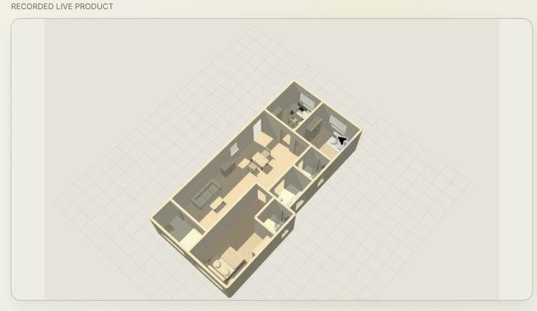
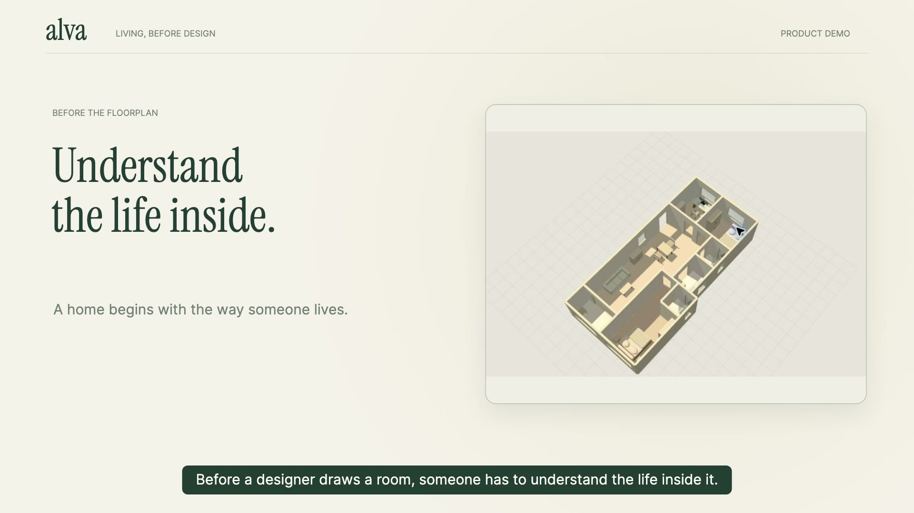
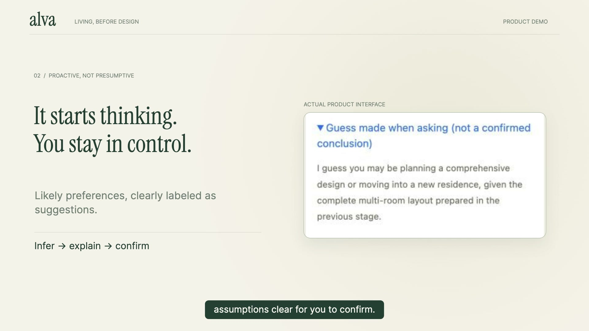
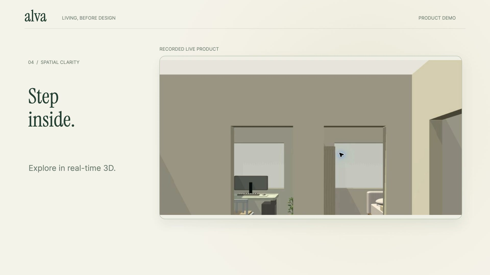
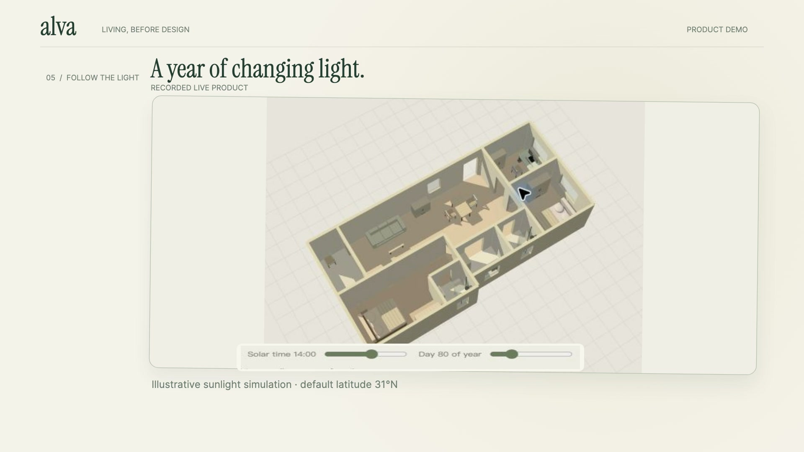
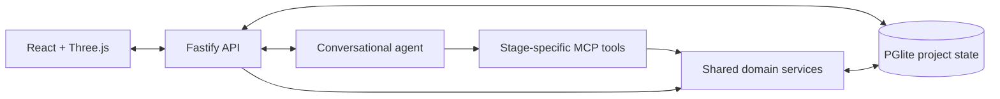

<div align="center">

# alva

**Make room for your life.**

Turn everyday living preferences into a designer-ready brief and an interactive view of your home.

[Live app](https://prod.huiyuanxp.com/) · [Watch the demo](https://github.com/huiyuanXP/alva/releases/download/product-demo-2026-09-28/alva-demo.mp4) · [Getting started](#getting-started) · [License](#license)

[](https://github.com/huiyuanXP/alva/releases/download/product-demo-2026-09-28/alva-demo.mp4)

</div>

alva helps homeowners explain how they live and helps designers spend less time on repetitive initial inquiries. A conversational agent gathers routines, preferences, constraints, and room requirements, connects them to the floorplan, and prepares a traceable brief for the next design conversation.

The hosted app requires an access code from its administrator. You can also [run it locally](#getting-started).

## Features

- **Conversational intake** — share needs through chat, guided questions, reference images, and voice transcribed into editable text.
- **Proactive suggestions** — the agent proposes likely preferences and follow-up choices. Inferences stay visibly separate from confirmed answers.
- **Floorplan import and calibration** — import a plan, review rooms and openings, and calibrate the model against a known measurement.
- **Spatial previews** — inspect furniture and room layouts in 2D and 3D, rotate the home, and look around from inside it.
- **Sunlight exploration** — vary solar time and season to see how illumination changes under the displayed geographic assumptions.
- **Designer-ready handoff** — collect needs, their sources, confirmed choices, and spatial views into a versioned delivery package.
- **Project continuity** — keep projects separate, save explicit snapshots, and return to an earlier design conversation.
- **English and Chinese** — switch the interface language while retaining original user input and conversation history.

## See it in action

The **76-second product demo** uses real interface recordings, with English narration and captions.

[](https://github.com/huiyuanXP/alva/releases/download/product-demo-2026-09-28/alva-demo.mp4)

[Download MP4](https://github.com/huiyuanXP/alva/releases/download/product-demo-2026-09-28/alva-demo.mp4) · [English subtitles](https://github.com/huiyuanXP/alva/releases/download/product-demo-2026-09-28/alva-demo.en.srt) · [Demo release](https://github.com/huiyuanXP/alva/releases/tag/product-demo-2026-09-28)

| Understand the preference | Explore the space |
| --- | --- |
|  |  |



Sunlight views are illustrative estimates, not on-site measurements. Layout suggestions and checks support the design conversation; they do not replace site measurements or professional review.

## How it works

1. **Bring a floorplan.** Upload your own drawing, check the interpreted geometry, and set a known wall length.
2. **Describe everyday life.** Explain routines, preferences, and what needs to work better. The agent asks focused follow-up questions.
3. **Review the possibilities.** Inspect suggestions and spatial previews, clarify assumptions, and confirm the changes you want.
4. **Hand off the context.** Save a version and export the brief together with its supporting information and views.

## Architecture

The browser combines a React interface with Three.js spatial views. A Fastify API manages project state in PGlite. The conversational agent runs through Codex App Server and accesses stage-specific MCP tools backed by shared domain services.



Models propose changes; application services validate the request, its scope, and any required user confirmation before applying it. The floorplan-import and living-design stages expose different tool sets.

## Getting started

### Requirements

- Node.js **22.12 or newer** and npm.
- A `codex` CLI available on `PATH`, providing the App Server interface used by the backend.
- An OpenAI-compatible provider that supports the Responses API and the configured models.
- Chromium for browser-based furniture rendering and browser checks.

### Install

```bash
git clone https://github.com/huiyuanXP/alva.git
cd alva
npm ci --ignore-scripts
npx playwright install chromium
cp .env.example .env
```

Edit `.env` with your own provider endpoint, API key, and model configuration. The current consultation model is defined in [`api/main-chat-agent.ts`](api/main-chat-agent.ts); the provider must support that model. `OPENAI_MODEL` is a fallback and does not override the consultation model. Voice input also requires the audio Chat Completions interface used by [`api/chat.ts`](api/chat.ts).

| Variable | Purpose |
| --- | --- |
| `OPENAI_BASE_URL` | Responses-compatible provider endpoint |
| `OPENAI_API_KEY` | Provider credential |
| `OPENAI_MODEL` | Fallback model for calls without an explicit model |
| `OPENAI_VISION_MODEL` | Floorplan image-recognition model |
| `OPENAI_FURNITURE_MODEL` | Furniture-model generation model |
| `ALVA_ORIGIN` | Application origin; local default `http://127.0.0.1:4180` |
| `ALVA_PORT` | Local HTTP port; default `4180` |
| `ALVA_DATA_DIR` | Project data directory; default `.runtime/alva-data` |

### Run

The application reads the process environment; it does not automatically load `.env`. On macOS or Linux:

```bash
set -a
. ./.env
set +a

npm run build:alva
npm run start:alva
```

Open **http://127.0.0.1:4180**. With the default configuration, the first startup writes a local sign-in code to `.runtime/alva-access-code`. Use that code on the login screen. A new project starts empty and expects your own floorplan.

### Development checks

```bash
npm run check
npm run build:alva

# Core project and business-flow tests
node_modules/.bin/tsx --test \
  tests/alva-foundation.test.ts \
  tests/alva-business.test.ts
```

## Project structure

```text
api/                    HTTP API, agent runtime, MCP tools, and domain services
web/                    React interface and Three.js scene rendering
packages/contracts/     Shared types, validation contracts, and localization
scripts/                Development and verification utilities
tests/                  Automated tests
docs/media/             Product screenshots and demo previews
ops/                    Deployment configuration
```

The active application uses `api/`, `web/`, and the `*:alva` commands above.

## Contributing

Bug reports and focused pull requests are welcome. For a bug report, include the behavior you expected, what happened, and a minimal reproduction. For code changes, run the relevant checks and describe the behavior the change verifies.

<a id="许可证"></a>

## License

Original project content is available under the [alva Learning and Personal Noncommercial License 1.0](LICENSE). It permits noncommercial learning, teaching, research, and personal or household use. Commercial use requires separate permission.

This is a custom source-available license, not an OSI-approved open-source license. Third-party components retain their own licenses.
