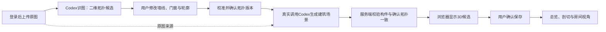

# 统一验证码与导入→建筑3D：首批研究结论

2026-09-19；用户已明确本轮只发布细化Ticket，不实施或上线。未生成验证码、未调用生产登录或数据接口、未改服务/权限/代码。正式首批索引：[本地tracker](../.scratch/alva-completion/README.md)。

## 1. 本轮结论

两个优先主题拆成6张可以各自展示的纵向票：01统一验证码；02导入并生成二维初稿；03改墙线/轮廓；04门窗与校准确认；05真实Codex生成建筑场景；06示例式建筑视角。每票消费明确输入并交付用户可观察结果，不按前端/后端横向拆票。原T03–T15不研究、不细分、不发布。

统一码是重复可用的共享登录凭证，不是短信一次性验证码；你拿到后自行分发。生成并交付真实有效验证码属于01的实施结果，本轮不给一个尚未生效的码。

## 2. 示例如何生成3D（已核对代码和浏览器）

来源为用户提供的room-study-handoff.zip中原型，并非先前假定的其他Roomscape文件名。

| 步骤 | 示例实际实现 | 对alva的意义 |
|---|---|---|
| 空间解释 | [model.js](../references/room-study-handoff/src/model.js)手写单户型坐标，估算11.2×6.8m、层高2.8m | 换图不能沿用这些常数，更不能声称示例本身已做AI自动建模 |
| 几何 | 一个单位立方体，按每对象position/size/yaw变换；地面、墙和基础家具分别记录 | 3D是实时几何，不是图片；新生成结果需要明确构件和尺寸 |
| 开口 | 墙体手动拆段留洞，窗玻璃为透明片 | 新链路应从确认门窗关系得到墙段/洞口，不能让模型独立重猜洞口 |
| 渲染 | [renderer.js](../references/room-study-handoff/src/renderer.js)原生WebGL2：先1536²深度阴影，再着色；3×3 PCF、玻璃Alpha Blend | 不必重写当前Three.js引擎即可实现对应画面能力 |
| 剖切 | 总览模式过滤墙对象（中心高度>0.9），不是改变存储拓扑 | 学习看清内部的交互目标，不照搬删墙语义或使碰撞跟着失效 |
| 视角 | [app.js](../references/room-study-handoff/src/app.js)固定Orbit目标和6个房间视点 | 任意户型应自动取景并按真实房间生成/校验视点 |
| 光照 | 日期/太阳时/纬度/北向计算太阳方向、色彩和强度 | 延续既有日照；这是视觉预览，不是精确日照结论 |

本轮隔离浏览器复核：50对象、14墙、6房间视点、40碰撞体，几何值有限，控制台错误0。已切换剖切/完整墙体并截图；[证据](../evidence/20260919T131207987Z-priority-research/result.json)、[完整墙体](../evidence/20260919T131207987Z-priority-research/reference-walls.png)、[剖切](../evidence/20260919T131207987Z-priority-research/reference-cutaway.png)。这些是参考原型研究，不是新功能验收。

原型预设家具与材质使画面丰富；当前首批聚焦建筑，不把固定家具复制进用户户型。U16等后续家具主题保持冻结。

## 3. alva已有链路与缺口

- [import.ts](../api/import.ts)已真实调用[Codex适配器](../api/codex.ts)，从图片得到墙/房间/开口JSON，坏几何最多请求一次修正。当前items被置空、尺寸先估算、之后用户校准；已有两布局历史证据，不需重做模型接入基础。
- [SceneView.tsx](../web/src/SceneView.tsx)由通用Three.js规则把墙挤出、给开口留洞、画房间地面和家具盒体；相机按范围取景。**现在没有“确认拓扑后再次调用Codex生成建筑场景”的独立步骤。**
- 现有二维端点拖动和校准只是部分基础：完整墙段/轮廓编辑、门窗专门编辑、可追溯拓扑确认版本、失效状态还需补齐。
- 当前没有示例的明确剖切开关；默认完整高墙会遮挡内部。建筑生成和视角展示拆成两票，可分别验生成内容与观看体验。
- 已有Codex调用证据只证明现有识图/工具协议可用；本轮未执行未来的新建筑生成协议，不声称其已成功。

## 4. 明确的Codex生成责任

识图和建筑生成是两次职责不同的模型调用，不把首次识图加固定相机视图充作后一次生成。

| 边界 | 拟采用合同（待各票实现） |
|---|---|
| 输入 | 原图来源、确认拓扑版本和指纹、米制坐标、层高/厚度/窗台等测量或估算说明、显示要求 |
| Codex负责 | 根据这些输入生成可渲染建筑构件、地面、门窗框/玻璃及材质/初始视角描述；明确各构件sourceEntityId |
| 不可改变 | 用户确认的墙线、房间轮廓、开口关系和标尺；输出若有冲突应修复或报错，不回写为“新事实” |
| 输出 | 有版本的结构化建筑场景，包含构件类型、位置/尺寸/旋转或轮廓、材质引用、相机及拓扑关联；由后端工具白名单消费 |
| 校验 | schema、有限值/正尺寸/单位/坐标轴、实体引用、墙与地面边界、开口一致、视角合法及场景预算；校准边仍满足0.01m合同 |
| 执行 | 固定浏览器渲染器解释已校验结果；Codex不获得生产文件写入权限，不直接执行返回的任意JavaScript/HTML |
| 生命周期 | 请求绑定确认拓扑版本→生成中→候选/失败/取消→用户确认；旧拓扑上的返回不能覆盖新版本，修改后旧3D标过期 |
| 保存/重试 | 保存产物而不是每次刷新重调模型；失败保留旧结果，明确状态；有限次模型修复仍失败则不报成功 |

这里的“生成3D”是生成真实几何场景描述，浏览器负责实时绘制；不是静态效果图，也不是把模型输出的说明文字显示在旧户型上。

## 5. 验证码入口研究

当前[api.ts](../api/api.ts)的public-access会自动交换已配置项目链接，[store.ts](../api/store.ts)按链接role建立7天会话。只删除登录按钮或只限制主页不足以阻止现有API/旧链接进入。

01必须同时处理登录页、服务端验证码核验、会话来源/有效期、旧匿名会话失效及旧链接绕过。现有项目/版本不删；验证码持有人获准进入当前项目，设计师角色不被升级，专业与跨项目权限不新增。错误尝试受限；正确同一码可在新设备重复建立会话。

原公共入口测试中“无需凭证即可进项目”的期望会被新的明确需求替代，但跨设备重复访问的验证保留在正确验证码之后。历史证据不删，测试覆盖不能通过删掉绕过检查来降低。

内部导出浏览器当前直接带会话截图，实施时须同步验证码准入合同，以免加了登录后导出拍到登录页；内部授权不能变成公众可调用的免码入口。验证码只在实施01时以私有配置保存并交给用户，不写本研究或票据。

## 6. 就绪判据和限制

- 6票都有独立用户结果、前置票和验收，不含账户体系、短信服务、完整漫游重写或自动家具布置。
- 01保持用户认可的粒度；T02进一步拆5步，每步能单独演示：看到识别初稿、修正墙线、确认校准拓扑、看到Codex产物、获得示例式可读视角。
- 技术债如完整代码重构不另开大票；确有必要的小型整理嵌入对应票，不能先把可用链路拆坏。
- 本轮只做源码研究和隔离示例观察，不跑生产模型、不创建用户数据/会话，不改线上权限。其余票不推进。
