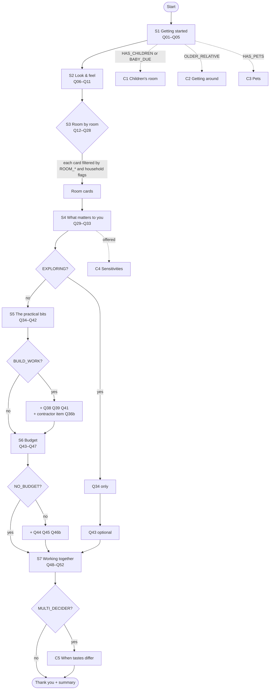

# Home Design Questionnaire — v4 (International, US English)

Machine-readable source for building the web question cards and the UML / flow diagrams.
Each card is defined in one fenced `yaml` block. Everything outside the yaml blocks is documentation.

---

## 0. Conventions

### 0.1 IDs

| Object | Pattern | Example |
|---|---|---|
| Stage | `S1`–`S7` | `S3` |
| Card (one screen) | `Q01`–`Q52`, conditional `C1`–`C5` | `Q12` |
| Item (one input on a card) | card ID + letter | `Q12a`, `Q12b` |
| Option | `<item>.<slug>` | `Q12a.shoes_pile_up` |
| Flag | `UPPER_SNAKE_CASE` | `HAS_CHILDREN` |
| Priority rule | `R01`… | `R03` |

IDs are stable. Never renumber. If a question is retired, keep its ID reserved.

### 0.2 Card schema

```yaml
card: Q00                 # card ID (one screen)
stage: S1                 # stage ID
title: "Short card title" # for navigation / UML node label
show_if: "always"         # condition (see 0.3); card hidden if false
insert_after: Q05         # conditional cards only: where they appear inline
prompt_variants:          # optional: alternative wording keyed by condition
  NEW_HOME: "Imagine…"
items:
  - id: Q00a
    field: field_key      # storage key for the answer
    type: single          # single | multi | text | number | number_unit | currency_range | date_rows | upload | country_city | ranking
    min: 0                # multi only
    max: 2                # multi only
    required: false       # default false; nothing in this questionnaire is required
    prompt: "User-facing question"
    helper: "Optional small print under the question"
    show_if: "always"     # item-level condition
    options:
      - id: Q00a.slug
        label: "Option label"
        show_if: "always" # option-level condition; option hidden if false
        exclusive: false  # true = selecting it clears the others
        sets: [FLAG]      # flags turned on when selected
        tags: [storage_pain] # analytics / rule tags
    logic: "Plain-language note for developers"
priority: P3              # default follow-up priority for this card (P1 high … P3 normal)
```

### 0.2.1 Extra keys and types

| Key / type | Meaning |
|---|---|
| `type: date` | Single date picker |
| `type: group` + `fields` | Several small inputs on one collapsible panel |
| `type: text_with_photo` | Free text with an optional image upload |
| `type: per_upload_text` + `prompt_pairs` | Short text prompts shown under each uploaded item |
| `type: repeat_group` + `fields` | "Add another" rows (e.g. one per pet) |
| `type: per_room_single` + `rooms_from` + `options_from` | One single-choice per room selected earlier |
| `type: date_rows` + `milestones` + `row_fields` | Milestone rows, each with a date and fixed/flexible flag |
| `type: currency_range` + `range_fields` | Currency picker + comfortable / maximum amounts |
| `options_from: <item>` | Options are copied from another item's selected answers |
| `display: image_cards` | Render options as image cards |
| `display_order_by_market` | Option order changes by market (no options hidden) |
| `label_variants` | Option label changes by condition (first matching key wins) |
| `note_if` | Small note shown under an option when the condition is true |
| `collapsed: true` | Item/card starts collapsed ("Add more detail") |
| `expanded_if` | Collapsed item opens automatically when the condition is true |
| `prefill_from` / `currency_default_from` | Suggested value from an earlier answer; the user must still confirm it |
| `stage_item` | An item asked once per stage, not tied to a card |
| `priority` | Default follow-up priority; rules in §3 can raise it |
| `&anchor` / `*alias` | YAML reuse of an option list (Q46) |

### 0.3 Condition grammar

| Syntax | Meaning |
|---|---|
| `always` | Always shown |
| `FLAG` | Flag is on |
| `!FLAG` | Flag is off |
| `A && B`, `A \|\| B`, `( … )` | Boolean logic |
| `selected(Q15a.takeout)` | That option was selected |
| `answered(Q11a)` | Item has an answer (not skipped / not sure) |
| `count_tag(storage_pain) >= 2` | Number of selected options carrying the tag |
| `any_market(US,UK)` | Shorthand for `MARKET_US \|\| MARKET_UK` |
| `count_selected(Q05a) >= 2` | Number of options selected in an item |
| `fixed_date_within_weeks(Q40a, 12)` | A row marked "Fixed" falls within N weeks of today |
| `responses_differ(Q06a, Q07a, …)` | Two or more decision-makers' separate responses differ on any listed item |
| `C3a.type includes cat` / `C3a.type in [dog, cat]` | Value test on a repeat-group or single field |

If a card's condition is false, all of its items are hidden. If an item's condition is false, only that item is hidden. If an option's condition is false, only that option is hidden. A hidden option can never be pre-selected.

### 0.4 Built-in controls (not listed in each block)

Every item automatically gets:

- `not_sure`: "Not sure yet" (status `unknown`)
- `skip`: "Skip" (status `skipped`)
- `other`: "Something else…" with free text, for `single` / `multi` items. Suppress with `other: false`.

Their IDs are `<item>.not_sure`, `<item>.skip` and `<item>.other` (e.g. `Q39a.not_sure`), so rules can reference them. None of these count as answers (except `other` with text), and none of them set flags. A skipped item can be reopened from the stage summary.

### 0.5 UX rules

- One card per screen. Show a progress bar per stage, not "question 34 of 57".
- Put a short summary at the end of each stage (`type: summary`) that the user can edit.
- Save automatically. The user can leave after any stage, and S1–S3 alone already give a useful brief.
- Answers from different people are stored separately, never merged.
- Currency and units are always confirmed by the user, never inferred from location.

---

## 1. Flags

| Flag | Set by | Effect (summary) |
|---|---|---|
| `NEW_HOME` | `Q01a.new_home` | Room cards ask "What would you like…" instead of "What bothers you…" (`prompt_variants`); S3_frame asked once |
| `REFRESH` | `Q01a.refresh` | — |
| `RENOVATING` | `Q01a.renovate` | Pre-highlights renovation options in Q35 (not pre-selected) |
| `ONE_ROOM` | `Q01a.one_room` | Q05a becomes single-select; S3 shows only that room + Q26, Q27, Q28 |
| `EXPLORING` | `Q01a.exploring` | Short path: S5 = Q34 only; S6 = Q43 only (optional) |
| `MARKET_US` / `MARKET_UK` / `MARKET_SG` / `MARKET_JP` / `MARKET_OTHER` | `Q02a` country | Localizes property types, approvals, bed sizes, channels, default units |
| `SOLO` | `Q04a.just_me` | Hides partner / housemate options |
| `PARTNER` | `Q04a.partner` | Shows partner-related options |
| `MULTI_ADULT` | `Q04a.partner`, `Q04a.housemates`, `Q04a.older_relatives` | Shows shared-space options |
| `HAS_CHILDREN` | `Q04a.children` | Shows children options and cards (Q22, C1) |
| `CHILD_UNDER3` / `CHILD_3_5` / `CHILD_6_12` / `CHILD_TEEN` | `Q04b` | Age-appropriate options inside C1, Q22 |
| `BABY_DUE` | `Q04a.baby_due` | Shows nursery options, C1; pre-fills milestone in Q40 |
| `OLDER_RELATIVE` | `Q04a.older_relatives` | Offers C2 |
| `HELPER` | `Q04a.helper` | Shows helper-related options |
| `HAS_PETS` | `Q04a.pets` | Shows pet options, C3 |
| `ROOM_ENTRY` `ROOM_LIVING` `ROOM_KITCHEN` `ROOM_DINING` `ROOM_BED` `ROOM_BATH` `ROOM_OFFICE` `ROOM_KIDS` `ROOM_LAUNDRY` `ROOM_GUEST` `ROOM_OUTDOOR` | `Q05a` (`whole_home` sets all) | Shows the matching S3 room cards |
| `NO_COOK` | `Q15a.takeout` | Hides Q16, Q15b, Q15c |
| `HEAVY_COOK` | `Q15a.serious` | Adds ventilation check; shows the wet/dry kitchen option in Q16 |
| `NO_WFH` | `Q21a.nobody` | Hides Q21b and work-from-home options later |
| `NO_GUESTS` | `Q24a.rarely` | Hides guest-room options later |
| `ACCESS_SIGNAL` | `Q20a.slippery` (bathroom safety), `Q30a.aging_here` | Offers C2 |
| `RENTING` | `Q34a.rent` | Hides resale, Q38, remodel-level options; Q39 shows landlord-only list |
| `BUILD_WORK` | `Q35a.renovation`, `Q35a.remodel` | Shows Q38, Q39, Q41, Q45, contractor item in Q36 |
| `FURNISH_ONLY` | `Q35a.refresh`, `Q35a.furnish` | Hides construction-related cards |
| `SCOPE_UNSURE` | `Q35a.unsure` | Shows Q38 / Q39 as optional |
| `NO_BUDGET` | `Q43a.see_options_first`, `Q43a.rather_not_say` | Hides Q44, Q45, over-budget item in Q46 |
| `MULTI_DECIDER` | `Q48a.together`, `Q48a.final_say`, `Q48a.split` | Shows C5; offers a separate response per decision-maker |

---

## 2. Flow diagram



Conditional cards C1–C5 are inserted inline at their `insert_after` position.

---

## 3. Follow-up priority rules (designer view)

Every answer is stored. Rules below decide what the designer brief shows at the top ("Talk about this first").

```yaml
priority_rules:
  - id: R01
    priority: P1
    when: "BUILD_WORK && (selected(Q39a.not_sure) || answered(Q39a))"
    note: "Approvals may be on the critical path. Confirm what applies before design work."
  - id: R02
    priority: P1
    when: "BUILD_WORK && (NO_BUDGET || !answered(Q43a))"
    note: "Renovation with no budget range. Scope can't be sized."
  - id: R03
    priority: P1
    when: "fixed_date_within_weeks(Q40a, 12) && (BUILD_WORK || selected(Q35a.furnish))"
    note: "Fixed date soon. Lead times for custom furniture (8–16+ weeks) may not fit."
  - id: R04
    priority: P1
    when: "RENTING && (selected(Q35a.renovation) || selected(Q35a.remodel))"
    note: "Renter wants building work. Check landlord consent."
  - id: R05
    priority: P1
    when: "BABY_DUE || answered(C2a)"
    note: "Child safety or access needs. Plan early and verify professionally."
  - id: R06
    priority: P1
    when: "answered(Q38a)"
    note: "Known fixed / structural elements. Arrange a survey."
  - id: R07
    priority: P1
    when: "MULTI_DECIDER && responses_differ(Q06a, Q07a, Q31a)"
    note: "Decision-makers disagree on feel, palette or priorities. Align before concepts."
  - id: R08
    priority: P2
    when: "selected(Q31a.cost_down) && selected(Q35a.remodel)"
    note: "Wants low cost and a full remodel. Manage expectations."
  - id: R09
    priority: P2
    when: "selected(Q06a.uncluttered) && selected(Q28a.love_display)"
    note: "Style goal vs habit tension (uncluttered vs display)."
  - id: R10
    priority: P2
    when: "selected(Q16a.open_plan) && HEAVY_COOK"
    note: "Wants open plan and does heavy cooking. Discuss ventilation and partition options."
  - id: R11
    priority: P2
    when: "answered(Q11a)"
    note: "Treasured piece. Get size, condition and photos; may anchor the scheme."
  - id: R12
    priority: P2
    when: "answered(Q09a) && !answered(Q09b)"
    note: "Inspiration uploaded without comments. Ask what caught their eye."
  - id: R13
    priority: P2
    when: "count_tag(storage_pain) >= 2"
    note: "Storage comes up in several rooms. Storage may be the real brief."
  - id: R14
    priority: P2
    when: "answered(Q29a) && !selected(Q29a.nothing)"
    note: "Cultural / religious requirement. Design it in from the start."
  - id: R15
    priority: P2
    when: "selected(Q27a.damp_mold) && BUILD_WORK"
    note: "Damp or mold. Investigate the cause before finishes."
  - id: R16
    priority: P2
    when: "answered(Q50d)"
    note: "Past experience shared. Read it before the first meeting."
  - id: R17
    priority: P2
    when: "answered(Q52a) || answered(C4a)"
    note: "Open questions or sensitivities noted."
  - id: R99
    priority: P3
    when: "always"
    note: "All other answers: context for the brief."
```

---

## S1 · Getting started

Stage intro: "Tell us a little about your home. There are no wrong answers, and you can skip anything. Most people finish this part in under two minutes."

### Q01 · What brings you here

```yaml
card: Q01
stage: S1
title: "What brings you here"
show_if: "always"
items:
  - id: Q01a
    field: project_entry_point
    type: single
    prompt: "Which of these sounds most like you right now?"
    options:
      - { id: Q01a.new_home,  label: "Moving into a new home",        sets: [NEW_HOME] }
      - { id: Q01a.refresh,   label: "Giving my current home a refresh", sets: [REFRESH] }
      - { id: Q01a.renovate,  label: "Planning a renovation",         sets: [RENOVATING] }
      - { id: Q01a.one_room,  label: "One room just isn't working",   sets: [ONE_ROOM] }
      - { id: Q01a.exploring, label: "Just exploring ideas",          sets: [EXPLORING] }
    other: false
    logic: "One tap. Replaces v1's multi-part goal question and sets the path length."
priority: P3
```

### Q02 · Where is your home

```yaml
card: Q02
stage: S1
title: "Location"
show_if: "always"
items:
  - id: Q02a
    field: property_context.location
    type: country_city
    prompt: "Where is the home you're thinking about?"
    helper: "Just the country and city. We don't need your address."
    logic: "Country sets MARKET_US | MARKET_UK | MARKET_SG | MARKET_JP, otherwise MARKET_OTHER. Also sets default units (US/SG: sq ft; UK/JP/other: m², user can switch) and a currency suggestion for Q43 that must be confirmed."
priority: P3
```

### Q03 · Type of home

```yaml
card: Q03
stage: S1
title: "Type of home"
show_if: "always"
items:
  - id: Q03a
    field: property_context.property_type
    type: single
    prompt: "What kind of home is it?"
    options:
      - { id: Q03a.single_family, label: "Single-family house",      show_if: "MARKET_US || MARKET_OTHER" }
      - { id: Q03a.detached,      label: "Detached house",           show_if: "MARKET_UK || MARKET_JP || MARKET_OTHER" }
      - { id: Q03a.semi,          label: "Semi-detached house",      show_if: "MARKET_UK" }
      - { id: Q03a.townhouse,     label: "Townhouse / terraced house", show_if: "!MARKET_SG" }
      - { id: Q03a.landed,        label: "Landed property",          show_if: "MARKET_SG" }
      - { id: Q03a.apartment,     label: "Apartment / flat",         show_if: "always" }
      - { id: Q03a.condo,         label: "Condo",                    show_if: "always" }
      - { id: Q03a.co_op,         label: "Co-op",                    show_if: "MARKET_US" }
      - { id: Q03a.hdb,           label: "HDB flat",                 show_if: "MARKET_SG" }
      - { id: Q03a.mansion,       label: "Mansion (condominium)",    show_if: "MARKET_JP" }
      - { id: Q03a.period,        label: "Period / historic property", show_if: "MARKET_UK || MARKET_US" }
  - id: Q03b
    field: property_context.details
    type: group
    prompt: "Add more detail (optional)"
    helper: "Collapsed by default."
    fields:
      - { id: Q03b.size,       type: number_unit, label: "Approximate size", units: [sqft, sqm] }
      - { id: Q03b.bedrooms,   type: number,      label: "Bedrooms" }
      - { id: Q03b.bathrooms,  type: number,      label: "Bathrooms" }
      - { id: Q03b.year_built, type: text,        label: "Roughly when was it built?" }
      - { id: Q03b.floor,      type: text,        label: "Floor level / elevator access", show_if: "selected(Q03a.apartment) || selected(Q03a.condo) || selected(Q03a.hdb) || selected(Q03a.mansion) || selected(Q03a.co_op)" }
priority: P3
```

### Q04 · Who's at home

```yaml
card: Q04
stage: S1
title: "Who's at home"
show_if: "always"
items:
  - id: Q04a
    field: occupants
    type: multi
    prompt: "Who lives with you, or is often around?"
    helper: "Share only what you're comfortable with."
    options:
      - { id: Q04a.just_me,         label: "Just me",                         exclusive: true, sets: [SOLO] }
      - { id: Q04a.partner,         label: "Partner / spouse",                sets: [PARTNER, MULTI_ADULT] }
      - { id: Q04a.children,        label: "Children",                        sets: [HAS_CHILDREN] }
      - { id: Q04a.baby_due,        label: "A baby on the way",               sets: [BABY_DUE] }
      - { id: Q04a.older_relatives, label: "Parents or older relatives (living with us or visiting often)", sets: [OLDER_RELATIVE, MULTI_ADULT] }
      - { id: Q04a.housemates,      label: "Roommates",                       sets: [MULTI_ADULT] }
      - { id: Q04a.helper,          label: "Live-in helper / nanny",          sets: [HELPER] }
      - { id: Q04a.pets,            label: "Pets",                            sets: [HAS_PETS] }
  - id: Q04b
    field: occupants.children_ages
    type: multi
    show_if: "HAS_CHILDREN"
    prompt: "How old are the children?"
    other: false
    options:
      - { id: Q04b.under3, label: "Under 3",  sets: [CHILD_UNDER3] }
      - { id: Q04b.age3_5, label: "3–5",      sets: [CHILD_3_5] }
      - { id: Q04b.age6_12, label: "6–12",    sets: [CHILD_6_12] }
      - { id: Q04b.teen,   label: "13+",      sets: [CHILD_TEEN] }
  - id: Q04c
    field: occupants.due_date
    type: date
    show_if: "BABY_DUE"
    prompt: "Due date (optional)"
logic: "Drives option-level visibility everywhere: no children → no kids, toys, crib or homework options; no pets → no pet options; SOLO → no partner or shared-space options."
priority: P3
```

### Q05 · Which spaces

```yaml
card: Q05
stage: S1
title: "Spaces in scope"
show_if: "always"
items:
  - id: Q05a
    field: scope.rooms
    type: multi            # becomes single if ONE_ROOM
    prompt: "Which spaces would you like help with? Pick as many as you like."
    prompt_variants:
      ONE_ROOM: "Which room isn't working for you?"
    options:
      - { id: Q05a.whole_home, label: "The whole home", exclusive: true, show_if: "!ONE_ROOM", sets: [ROOM_ENTRY, ROOM_LIVING, ROOM_KITCHEN, ROOM_DINING, ROOM_BED, ROOM_BATH, ROOM_OFFICE, ROOM_LAUNDRY, ROOM_GUEST, ROOM_OUTDOOR] }
      - { id: Q05a.entry,      label: "Entryway / hallway",   sets: [ROOM_ENTRY] }
      - { id: Q05a.living,     label: "Living room",          sets: [ROOM_LIVING] }
      - { id: Q05a.kitchen,    label: "Kitchen",              sets: [ROOM_KITCHEN] }
      - { id: Q05a.dining,     label: "Dining area",          sets: [ROOM_DINING] }
      - { id: Q05a.bedroom,    label: "Bedroom(s)",           sets: [ROOM_BED] }
      - { id: Q05a.bathroom,   label: "Bathroom(s)",          sets: [ROOM_BATH] }
      - { id: Q05a.office,     label: "Home office",          sets: [ROOM_OFFICE] }
      - { id: Q05a.kids,       label: "Kids' room",           show_if: "HAS_CHILDREN && (CHILD_3_5 || CHILD_6_12 || CHILD_TEEN || !answered(Q04b))", sets: [ROOM_KIDS] }
      - { id: Q05a.nursery,    label: "Nursery",              show_if: "BABY_DUE || CHILD_UNDER3", sets: [ROOM_KIDS] }
      - { id: Q05a.laundry,    label: "Laundry / utility room", sets: [ROOM_LAUNDRY] }
      - { id: Q05a.guest,      label: "Guest room",           sets: [ROOM_GUEST] }
      - { id: Q05a.outdoor,    label: "Balcony / patio / yard / garden", sets: [ROOM_OUTDOOR] }
    logic: "whole_home also sets ROOM_KIDS if HAS_CHILDREN || BABY_DUE."
  - id: Q05b
    field: scope.priority_room
    type: single
    show_if: "!ONE_ROOM && count_selected(Q05a) >= 2"
    prompt: "Which one matters most right now?"
    options_from: Q05a     # dynamic: the rooms selected in Q05a
    logic: "Room cards for this room are shown first in S3."
priority: P3
```

**S1 summary** (`type: summary`): "So far: a [Q03a] in [Q02a], for [Q04a], focusing on [Q05a]. Look right?"

---

## S2 · Look & feel

Stage intro: "Now for the fun part. Go with your gut."

### Q06 · How it should feel

```yaml
card: Q06
stage: S2
title: "How it should feel"
show_if: "always"
items:
  - id: Q06a
    field: tone
    type: multi
    max: 3
    prompt: "Forget style names for a moment. When you walk in, how do you want your home to feel? Pick up to three."
    options:
      - { id: Q06a.cozy,        label: "Warm & cozy" }
      - { id: Q06a.calm,        label: "Calm & serene" }
      - { id: Q06a.uncluttered, label: "Clean & uncluttered" }
      - { id: Q06a.bright,      label: "Bright & airy" }
      - { id: Q06a.lived_in,    label: "Relaxed & lived-in" }
      - { id: Q06a.playful,     label: "Playful & colorful" }
      - { id: Q06a.elegant,     label: "Elegant & refined" }
      - { id: Q06a.bold,        label: "Bold & dramatic" }
      - { id: Q06a.natural,     label: "Natural & organic" }
      - { id: Q06a.welcoming,   label: "Welcoming for guests" }
priority: P3
```

### Q07 · Palette

```yaml
card: Q07
stage: S2
title: "Color palette"
show_if: "always"
items:
  - id: Q07a
    field: color_palette
    type: single
    display: image_cards
    prompt: "Which of these palettes feels most like you?"
    options:
      - { id: Q07a.warm_light_wood, label: "Warm whites & light wood" }
      - { id: Q07a.warm_deep_wood,  label: "Warm neutrals & deeper wood" }
      - { id: Q07a.cool_gray,       label: "Cool whites & grays" }
      - { id: Q07a.white_pops,      label: "Crisp white with pops of color" }
      - { id: Q07a.moody,           label: "Rich, deep, moody colors" }
      - { id: Q07a.earthy,          label: "Earthy tones (terracotta, olive, sand)" }
      - { id: Q07a.samples_first,   label: "I'd like to see real samples first" }
  - id: Q07b
    field: colors_love_avoid
    type: text
    prompt: "Any colors you love, or would never have? (optional)"
priority: P3
```

### Q08 · Styles (optional)

```yaml
card: Q08
stage: S2
title: "Styles (optional)"
show_if: "always"
items:
  - id: Q08a
    field: style
    type: multi
    display: image_cards
    prompt: "Do any of these style names mean something to you? Totally optional."
    options:
      - { id: Q08a.dont_know,     label: "I just know what I like when I see it", exclusive: true }
      - { id: Q08a.modern,        label: "Modern / contemporary" }
      - { id: Q08a.minimalist,    label: "Minimalist" }
      - { id: Q08a.scandinavian,  label: "Scandinavian" }
      - { id: Q08a.japandi,       label: "Japandi" }
      - { id: Q08a.mid_century,   label: "Mid-century modern" }
      - { id: Q08a.traditional,   label: "Traditional / classic" }
      - { id: Q08a.transitional,  label: "Transitional" }
      - { id: Q08a.farmhouse,     label: "Farmhouse / cottage" }
      - { id: Q08a.industrial,    label: "Industrial" }
      - { id: Q08a.coastal,       label: "Coastal / resort" }
      - { id: Q08a.boho,          label: "Bohemian / eclectic" }
      - { id: Q08a.art_deco,      label: "Art Deco" }
      - { id: Q08a.wabi_sabi,     label: "Wabi-sabi" }
    logic: "Stored as the user's own words. Designer checks against Q09 images."
priority: P3
```

### Q09 · Inspiration (optional)

```yaml
card: Q09
stage: S2
title: "Inspiration"
show_if: "always"
items:
  - id: Q09a
    field: references
    type: upload
    accepts: [image, link]
    prompt: "Got pictures you love? Pinterest boards, Houzz, Instagram, a hotel, a friend's place: anything goes."
  - id: Q09b
    field: references.annotations
    type: per_upload_text
    show_if: "answered(Q09a)"
    prompt_pairs:
      - "What caught your eye?"
      - "Anything you'd leave out?"
    logic: "Shown under each uploaded image or link. Never claim to have seen a link that failed to load."
priority: P3
```

### Q10 · Definite no's

```yaml
card: Q10
stage: S2
title: "Definite no's"
show_if: "always"
items:
  - id: Q10a
    field: dislikes
    type: multi
    prompt: "Is there anything you'd really rather not have?"
    options:
      - { id: Q10a.high_gloss,    label: "High-gloss surfaces" }
      - { id: Q10a.shiny_gold,    label: "Shiny gold or brass" }
      - { id: Q10a.mirrored,      label: "Mirrored furniture" }
      - { id: Q10a.open_shelving, label: "Lots of open shelving" }
      - { id: Q10a.all_gray,      label: "Gray everywhere" }
      - { id: Q10a.wallpaper,     label: "Wallpaper" }
      - { id: Q10a.carpet,        label: "Wall-to-wall carpet" }
      - { id: Q10a.dark_rooms,    label: "Very dark rooms" }
priority: P3
```

### Q11 · A piece you'd never part with

```yaml
card: Q11
stage: S2
title: "Treasured piece"
show_if: "always"
items:
  - id: Q11a
    field: retained
    type: text_with_photo
    prompt: "Is there something you'd love to keep because it means something to you? A family piece, some art, a favorite chair…"
    helper: "Leave blank if nothing comes to mind."
    logic: "If answered, the designer asks for size and condition later (replaces v1's full furniture inventory)."
priority: P2   # R11
```

**S2 summary:** "You'd like it to feel [Q06a], leaning toward [Q07a]. Anything to change?"

---

## S3 · Room by room

Stage intro: "Now let's go through the spaces you picked, one by one. We'll only ask about the rooms you chose."

Stage rules:

- Show a card only if its `show_if` is true. Cards for the priority room (`Q05b`) come first; the rest follow in ID order.
- If `ONE_ROOM`: show only the chosen room's cards plus Q26, Q27, Q28.
- If `NEW_HOME`: ask the stage item `S3_frame` once at the start, and use the `NEW_HOME` prompt variants ("What would you like…" instead of "What bothers you…").
- Default `max: 3` for room multi-selects.

```yaml
stage_item:
  id: S3_frame
  field: room_answers_frame
  type: single
  show_if: "NEW_HOME"
  prompt: "For the room questions, are you thinking about…"
  options:
    - { id: S3_frame.current, label: "What doesn't work in my current home" }
    - { id: S3_frame.wish,    label: "What I'd like in the new one" }
  logic: "Asked once. Tells the designer whether a pain point is a real habit or a wish."
```

### Q12 · Entryway

```yaml
card: Q12
stage: S3
title: "Entryway"
show_if: "ROOM_ENTRY"
items:
  - id: Q12a
    field: room.entry.needs
    type: multi
    max: 3
    prompt: "What does your entryway need to handle better?"
    prompt_variants:
      NEW_HOME: "What would you like your new entryway to handle?"
    options:
      - { id: Q12a.drop_zone,   label: "A spot for keys, bags and mail", tags: [storage_pain] }
      - { id: Q12a.shoes,       label: "Shoe storage", tags: [storage_pain] }
      - { id: Q12a.coats,       label: "Coats, bags and umbrellas", tags: [storage_pain] }
      - { id: Q12a.packages,    label: "Somewhere for packages and deliveries" }
      - { id: Q12a.stroller,    label: "Room for a stroller and kids' gear", show_if: "HAS_CHILDREN || BABY_DUE", tags: [storage_pain] }
      - { id: Q12a.bikes_gear,  label: "Bikes and sports gear", tags: [storage_pain] }
      - { id: Q12a.pet_station, label: "A pet station (leashes, paw cleaning)", show_if: "HAS_PETS" }
      - { id: Q12a.bench,       label: "A bench or seat" }
      - { id: Q12a.first_impression, label: "A better first impression (mirror, lighting, art)" }
      - { id: Q12a.works_fine,  label: "It works fine as is", exclusive: true }
  - id: Q12b
    field: household.shoes_off
    type: single
    prompt: "Is yours a shoes-off home?"
    other: false
    options:
      - { id: Q12b.always,    label: "Yes, always" }
      - { id: Q12b.sometimes, label: "Sometimes" }
      - { id: Q12b.no,        label: "No" }
    logic: "always → shoe storage, a place to sit and guest slippers in the entry brief."
priority: P3
```

### Q13 · Living room

```yaml
card: Q13
stage: S3
title: "Living room"
show_if: "ROOM_LIVING"
items:
  - id: Q13a
    field: room.living.uses
    type: multi
    max: 3
    prompt: "What will the living room mainly be used for?"
    options:
      - { id: Q13a.relaxing,  label: "Relaxing" }
      - { id: Q13a.tv,        label: "TV and movies" }
      - { id: Q13a.gaming,    label: "Gaming" }
      - { id: Q13a.conversation, label: "Conversation and family time", show_if: "!SOLO" }
      - { id: Q13a.entertaining, label: "Entertaining guests" }
      - { id: Q13a.kids_play, label: "Kids' play", show_if: "HAS_CHILDREN && (CHILD_UNDER3 || CHILD_3_5 || CHILD_6_12)" }
      - { id: Q13a.reading,   label: "Reading, music or hobbies" }
      - { id: Q13a.working,   label: "Working", show_if: "!NO_WFH" }
      - { id: Q13a.exercise,  label: "Exercise / yoga" }
  - id: Q13b
    field: room.living.seating
    type: number
    prompt: "How many people should it seat day to day?"
  - id: Q13c
    field: room.living.tv
    type: single
    prompt: "What about the TV?"
    other: false
    options:
      - { id: Q13c.wall,     label: "Wall-mounted" }
      - { id: Q13c.console,  label: "On a media console" }
      - { id: Q13c.hidden,   label: "Hidden when not in use" }
      - { id: Q13c.no_tv,    label: "No TV in this room" }
  - id: Q13d
    field: room.living.pain_points
    type: multi
    prompt: "What would you most like to fix in the living room?"
    prompt_variants:
      NEW_HOME: "What matters most to get right in the living room?"
    options:
      - { id: Q13d.seating,     label: "More or better seating" }
      - { id: Q13d.comfort,     label: "A more comfortable sofa" }
      - { id: Q13d.layout,      label: "The furniture layout" }
      - { id: Q13d.lighting,    label: "Lighting" }
      - { id: Q13d.storage,     label: "Storage for media, books and everyday clutter", tags: [storage_pain] }
      - { id: Q13d.toy_storage, label: "Toy storage", show_if: "HAS_CHILDREN", tags: [storage_pain] }
      - { id: Q13d.floor_space, label: "More open floor space" }
      - { id: Q13d.pet_proof,   label: "Pet-proof fabrics and finishes", show_if: "HAS_PETS" }
      - { id: Q13d.personality, label: "It needs more personality" }
priority: P3
```

### Q14 · Entertaining

```yaml
card: Q14
stage: S3
title: "Entertaining"
show_if: "ROOM_LIVING || ROOM_DINING || ROOM_KITCHEN"
items:
  - id: Q14a
    field: hosting_profile.style
    type: single
    prompt: "How do you usually entertain at home?"
    options:
      - { id: Q14a.rarely,         label: "We rarely have people over" }
      - { id: Q14a.kitchen_drinks, label: "Casual drinks and snacks" }
      - { id: Q14a.dinner,         label: "Sit-down dinners" }
      - { id: Q14a.big_holidays,   label: "Big parties and holidays (Thanksgiving, Christmas, Lunar New Year…)" }
      - { id: Q14a.playdates,      label: "Playdates and kids' parties", show_if: "HAS_CHILDREN" }
  - id: Q14b
    field: hosting_profile.max_guests
    type: number
    show_if: "!selected(Q14a.rarely)"
    prompt: "How many guests at the most, roughly?"
    logic: "Sets peak seating for Q17. big_holidays → extendable seating in the brief."
priority: P3
```

### Q15 · Kitchen

```yaml
card: Q15
stage: S3
title: "Kitchen"
show_if: "ROOM_KITCHEN"
items:
  - id: Q15a
    field: room.kitchen.cooking_frequency
    type: single
    prompt: "How often do you cook?"
    options:
      - { id: Q15a.takeout,       label: "Rarely, mostly takeout or reheating", sets: [NO_COOK] }
      - { id: Q15a.quick,         label: "A few times a week, simple meals" }
      - { id: Q15a.home_cooked,   label: "Most days" }
      - { id: Q15a.serious,       label: "Every day, including heavy cooking (stir-frying, spices, lots of steam)", sets: [HEAVY_COOK] }
      - { id: Q15a.partner_cooks, label: "My partner does most of the cooking", show_if: "PARTNER" }
      - { id: Q15a.helper_cooks,  label: "Our helper does most of the cooking", show_if: "HELPER" }
  - id: Q15b
    field: room.kitchen.pain_points
    type: multi
    show_if: "!NO_COOK"
    prompt: "What would you most like to improve in the kitchen?"
    prompt_variants:
      NEW_HOME: "What matters most to you in the new kitchen?"
    options:
      - { id: Q15b.counter,     label: "More counter space" }
      - { id: Q15b.storage,     label: "More or better-organized storage", tags: [storage_pain] }
      - { id: Q15b.ventilation, label: "Better ventilation (smoke and smells)" }
      - { id: Q15b.layout,      label: "A better layout / workflow" }
      - { id: Q15b.two_cooks,   label: "Room for two people to cook", show_if: "MULTI_ADULT || HELPER" }
      - { id: Q15b.island,      label: "An island or breakfast bar" }
      - { id: Q15b.pantry,      label: "A pantry" }
      - { id: Q15b.appliances,  label: "New or upgraded appliances" }
      - { id: Q15b.look,        label: "An updated look" }
  - id: Q15c
    field: room.kitchen.appliances
    type: text
    show_if: "!NO_COOK"
    prompt: "Any must-have appliances? (optional)"
    helper: "e.g. induction cooktop, double oven, dishwasher, wine fridge, steam oven, rice cooker"
logic: "HEAVY_COOK → ventilation check; HEAVY_COOK && MARKET_SG → Q16a.wet_dry shown."
priority: P3
```

### Q16 · Kitchen layout

```yaml
card: Q16
stage: S3
title: "Kitchen layout"
show_if: "ROOM_KITCHEN && !NO_COOK"
items:
  - id: Q16a
    field: room.kitchen.openness
    type: single
    prompt: "Would you prefer an open or closed kitchen?"
    options:
      - { id: Q16a.open_plan, label: "Open, connected to the living / dining area" }
      - { id: Q16a.closed,    label: "Closed, a separate room (keeps smells and mess contained)" }
      - { id: Q16a.flexible,  label: "Flexible, e.g. sliding doors or a glass partition" }
      - { id: Q16a.wet_dry,   label: "A wet and dry kitchen split", show_if: "MARKET_SG || HEAVY_COOK" }
      - { id: Q16a.keep,      label: "Keep the current layout", show_if: "!NEW_HOME" }
    logic: "See R10 (open_plan + HEAVY_COOK)."
priority: P3
```

### Q17 · Dining

```yaml
card: Q17
stage: S3
title: "Dining"
show_if: "ROOM_DINING || ROOM_KITCHEN"
items:
  - id: Q17a
    field: room.dining.daily_seats
    type: number
    prompt: "How many people eat at the table day to day?"
  - id: Q17b
    field: room.dining.format
    type: single
    prompt: "What kind of dining setup would suit you best?"
    options:
      - { id: Q17b.fixed_table,   label: "A dining table that seats everyone" }
      - { id: Q17b.extendable,    label: "An extendable table for when guests come", show_if: "!selected(Q14a.rarely)" }
      - { id: Q17b.island,        label: "An island or breakfast bar is enough" }
      - { id: Q17b.formal,        label: "A separate, formal dining room" }
      - { id: Q17b.round_compact, label: "A small round table to save space" }
  - id: Q17c
    field: room.dining.other_uses
    type: multi
    prompt: "Will the table be used for anything else?"
    options:
      - { id: Q17c.meals_only, label: "Just meals", exclusive: true }
      - { id: Q17c.homework,   label: "Homework and crafts", show_if: "HAS_CHILDREN" }
      - { id: Q17c.working,    label: "Working from home", show_if: "!NO_WFH" }
      - { id: Q17c.hobbies,    label: "Hobbies, puzzles or games" }
priority: P3
```

### Q18 · Bedrooms

```yaml
card: Q18
stage: S3
title: "Bedrooms"
show_if: "ROOM_BED"
items:
  - id: Q18a
    field: room.bedroom.priorities
    type: multi
    max: 3
    prompt: "What would you most like to improve in the bedroom?"
    prompt_variants:
      NEW_HOME: "What matters most to you in the new bedroom?"
    options:
      - { id: Q18a.blackout,   label: "Blackout / better window coverings" }
      - { id: Q18a.quiet,      label: "Keeping it quiet" }
      - { id: Q18a.temperature, label: "Temperature" }
      - { id: Q18a.bedside,    label: "Bedside storage and lighting", tags: [storage_pain] }
      - { id: Q18a.no_work,    label: "Keeping work out of the bedroom", show_if: "!NO_WFH" }
      - { id: Q18a.reading_nook, label: "A reading chair or nook" }
      - { id: Q18a.tv,         label: "A TV" }
      - { id: Q18a.crib_space, label: "Room for a crib or bassinet", show_if: "BABY_DUE || CHILD_UNDER3" }
      - { id: Q18a.more_space, label: "More open floor space" }
      - { id: Q18a.calmer,     label: "A calmer, more restful look" }
  - id: Q18b
    field: room.bedroom.bed_size
    type: single
    prompt: "What size bed would you like in the main bedroom?"
    other: false
    options:
      - { id: Q18b.twin,        label: "Twin",            show_if: "MARKET_US" }
      - { id: Q18b.full,        label: "Full",            show_if: "MARKET_US" }
      - { id: Q18b.queen,       label: "Queen",           show_if: "MARKET_US || MARKET_SG || MARKET_OTHER" }
      - { id: Q18b.king,        label: "King",            show_if: "always" }
      - { id: Q18b.cal_king,    label: "California King", show_if: "MARKET_US" }
      - { id: Q18b.single,      label: "Single",          show_if: "!MARKET_US" }
      - { id: Q18b.double,      label: "Double",          show_if: "!MARKET_US" }
      - { id: Q18b.super_king,  label: "Super King",      show_if: "MARKET_UK || MARKET_SG" }
      - { id: Q18b.semi_double, label: "Semi-double",     show_if: "MARKET_JP" }
      - { id: Q18b.futon,       label: "Futon / floor bed", show_if: "MARKET_JP || MARKET_OTHER" }
    logic: "Store the size name and market separately; dimensions are a derived value only."
priority: P3
```

### Q19 · Closets & dressing

```yaml
card: Q19
stage: S3
title: "Closets & dressing"
show_if: "ROOM_BED"
items:
  - id: Q19a
    field: room.bedroom.closet
    type: multi
    prompt: "What do you need from your closet and dressing space?"
    options:
      - { id: Q19a.more_space,  label: "More hanging and drawer space", tags: [storage_pain] }
      - { id: Q19a.organized,   label: "Easier to see and find things", tags: [storage_pain] }
      - { id: Q19a.walk_in,     label: "A walk-in closet" }
      - { id: Q19a.his_hers,    label: "Separate space for each of us", show_if: "PARTNER" }
      - { id: Q19a.dressing,    label: "A dressing table or vanity" }
      - { id: Q19a.mirror,      label: "A full-length mirror and good light" }
      - { id: Q19a.seasonal,    label: "Storage for seasonal clothes and luggage", tags: [storage_pain] }
      - { id: Q19a.fine,        label: "It's fine as is", exclusive: true }
priority: P3
```

### Q20 · Bathrooms

```yaml
card: Q20
stage: S3
title: "Bathrooms"
show_if: "ROOM_BATH"
items:
  - id: Q20a
    field: room.bathroom.priorities
    type: multi
    max: 3
    prompt: "What would you most like to improve in the bathroom?"
    prompt_variants:
      NEW_HOME: "What matters most to you in the new bathroom?"
    options:
      - { id: Q20a.storage,       label: "More storage", tags: [storage_pain] }
      - { id: Q20a.easy_clean,    label: "Easier to clean" }
      - { id: Q20a.steam_mold,    label: "Better ventilation / less mold" }
      - { id: Q20a.lighting,      label: "Better lighting and mirror" }
      - { id: Q20a.double_vanity, label: "A double vanity", show_if: "!SOLO" }
      - { id: Q20a.updated_look,  label: "An updated look" }
      - { id: Q20a.kid_friendly,  label: "Kid-friendly (bath time, step stool, storage for bath toys)", show_if: "HAS_CHILDREN && (CHILD_UNDER3 || CHILD_3_5 || CHILD_6_12)" }
      - { id: Q20a.slippery,      label: "Safety: grab bars, non-slip floor, step-free shower", sets: [ACCESS_SIGNAL] }
      - { id: Q20a.accessories,   label: "Just new accessories, no renovation", show_if: "!BUILD_WORK" }
  - id: Q20b
    field: room.bathroom.bath_or_shower
    type: single
    prompt: "Bathtub or shower?"
    other: false
    options:
      - { id: Q20b.bath,    label: "I want a bathtub" }
      - { id: Q20b.shower,  label: "I want a walk-in shower" }
      - { id: Q20b.both,    label: "Both" }
      - { id: Q20b.neither, label: "No preference" }
  - id: Q20c
    field: room.bathroom.features
    type: multi
    prompt: "Any specific features? (optional)"
    options:
      - { id: Q20c.bidet,        label: "Bidet / smart toilet" }
      - { id: Q20c.heated_floor, label: "Heated floor" }
      - { id: Q20c.towel_warmer, label: "Towel warmer" }
      - { id: Q20c.sep_toilet,   label: "Separate toilet room" }
      - { id: Q20c.rain_shower,  label: "Rain shower" }
priority: P3
```

### Q21 · Home office

```yaml
card: Q21
stage: S3
title: "Home office / work from home"
show_if: "!ONE_ROOM || ROOM_OFFICE"
items:
  - id: Q21a
    field: workspace_needs.current
    type: single
    prompt: "Does anyone work or study from home? What kind of workspace do you need?"
    options:
      - { id: Q21a.nobody,      label: "Nobody here works from home", sets: [NO_WFH] }
      - { id: Q21a.flexible,    label: "A flexible spot I can tidy away" }
      - { id: Q21a.corner_desk, label: "A dedicated desk in a shared room" }
      - { id: Q21a.office,      label: "A separate office with a door" }
      - { id: Q21a.two_callers, label: "Workspaces for more than one person", show_if: "MULTI_ADULT" }
  - id: Q21b
    field: workspace_needs.frequency
    type: single
    show_if: "!NO_WFH"
    prompt: "How often?"
    other: false
    options:
      - { id: Q21b.occasional, label: "Occasionally" }
      - { id: Q21b.few_days,   label: "A few days a week" }
      - { id: Q21b.daily,      label: "Every day" }
  - id: Q21c
    field: workspace_needs.requirements
    type: multi
    show_if: "!NO_WFH"
    prompt: "What does the workspace need?"
    options:
      - { id: Q21c.video_bg,  label: "A tidy background for video calls" }
      - { id: Q21c.quiet,     label: "Quiet / a door" }
      - { id: Q21c.monitors,  label: "Room for monitors and equipment" }
      - { id: Q21c.cables,    label: "Hidden cables and plenty of outlets" }
      - { id: Q21c.storage,   label: "Storage for files and supplies", tags: [storage_pain] }
      - { id: Q21c.daylight,  label: "Good daylight" }
priority: P3
```

### Q22 · Kids' play and study

```yaml
card: Q22
stage: S3
title: "Kids' play & study"
show_if: "HAS_CHILDREN"
items:
  - id: Q22a
    field: household.kids_space
    type: multi
    prompt: "Where should the kids play and study?"
    options:
      - { id: Q22a.living_room,    label: "Play area in the living room", show_if: "CHILD_UNDER3 || CHILD_3_5 || CHILD_6_12" }
      - { id: Q22a.own_rooms,      label: "Mostly in their own rooms" }
      - { id: Q22a.playroom,       label: "A dedicated playroom", show_if: "CHILD_UNDER3 || CHILD_3_5 || CHILD_6_12" }
      - { id: Q22a.toys_took_over, label: "We need much better toy storage", tags: [storage_pain], show_if: "CHILD_UNDER3 || CHILD_3_5 || CHILD_6_12" }
      - { id: Q22a.screens_homework, label: "A good desk for homework", show_if: "CHILD_6_12 || CHILD_TEEN" }
      - { id: Q22a.teen_space,     label: "A space for teens to hang out with friends", show_if: "CHILD_TEEN" }
logic: "Triggers C1 if not already shown."
priority: P3
```

### Q23 · Laundry & utility

```yaml
card: Q23
stage: S3
title: "Laundry & utility"
show_if: "ROOM_LAUNDRY"
items:
  - id: Q23a
    field: room.utility.needs
    type: multi
    prompt: "What does your laundry / utility space need?"
    options:
      - { id: Q23a.nowhere_to_dry,  label: "Somewhere to dry clothes" }
      - { id: Q23a.folding,         label: "A folding counter", tags: [storage_pain] }
      - { id: Q23a.cleaning_storage, label: "Storage for the vacuum, ironing board and cleaning supplies", tags: [storage_pain] }
      - { id: Q23a.stacked,         label: "A stacked washer and dryer to save space" }
      - { id: Q23a.sink,            label: "A utility sink" }
      - { id: Q23a.out_of_kitchen,  label: "Moving the laundry out of the kitchen", show_if: "!RENTING" }
      - { id: Q23a.fine,            label: "It's fine as is", exclusive: true }
  - id: Q23b
    field: room.utility.drying_method
    type: single
    prompt: "How do you usually dry clothes?"
    other: false
    options:
      - { id: Q23b.dryer,   label: "Dryer" }
      - { id: Q23b.rack,    label: "Indoor rack" }
      - { id: Q23b.outside, label: "Outside / on the balcony" }
      - { id: Q23b.mix,     label: "A mix" }
priority: P3
```

### Q24 · Guest room

```yaml
card: Q24
stage: S3
title: "Guests"
show_if: "ROOM_GUEST || ROOM_LIVING"
items:
  - id: Q24a
    field: hosting_profile.overnight
    type: single
    prompt: "How often do you have overnight guests, and where should they sleep?"
    options:
      - { id: Q24a.rarely,          label: "Rarely or never", sets: [NO_GUESTS] }
      - { id: Q24a.sofa_bed,        label: "A few times a year: a sofa bed is fine" }
      - { id: Q24a.dual_use,        label: "A room that works as a guest room and an office / hobby room" }
      - { id: Q24a.want_guest_room, label: "Often: we'd like a dedicated guest room" }
      - { id: Q24a.long_stays,      label: "Long stays (e.g. parents for weeks): they need their own storage and privacy" }
priority: P3
```

### Q25 · Outdoor space

```yaml
card: Q25
stage: S3
title: "Outdoor space"
show_if: "ROOM_OUTDOOR"
items:
  - id: Q25a
    field: room.outdoor.uses
    type: multi
    prompt: "How would you like to use your balcony, patio or yard?"
    options:
      - { id: Q25a.dining,    label: "Outdoor dining" }
      - { id: Q25a.lounging,  label: "Lounging and relaxing" }
      - { id: Q25a.plants,    label: "Plants and gardening" }
      - { id: Q25a.bbq,       label: "Grilling / barbecue" }
      - { id: Q25a.kids_play, label: "A play area for the kids", show_if: "HAS_CHILDREN" }
      - { id: Q25a.pets,      label: "Space for the pets", show_if: "HAS_PETS" }
      - { id: Q25a.utility,   label: "Drying laundry and storage" }
      - { id: Q25a.indoor_outdoor, label: "Making it feel like part of the inside" }
priority: P3
```

### Q26 · Lighting

```yaml
card: Q26
stage: S3
title: "Lighting"
show_if: "always"
items:
  - id: Q26a
    field: lighting.preference
    type: single
    prompt: "What kind of lighting would you like?"
    options:
      - { id: Q26a.soft_warm,  label: "Soft and warm" }
      - { id: Q26a.bright,     label: "Bright and practical" }
      - { id: Q26a.moods,      label: "Dimmable, with different moods in different rooms" }
      - { id: Q26a.one_switch, label: "Simple: one switch per room" }
  - id: Q26b
    field: lighting.pain_points
    type: multi
    show_if: "!NEW_HOME || selected(S3_frame.current)"
    prompt: "Anything that bothers you about the lighting now?"
    options:
      - { id: Q26b.too_dark,    label: "Too dark" }
      - { id: Q26b.harsh,       label: "Harsh overhead light" }
      - { id: Q26b.task,        label: "Not enough light to read or cook" }
      - { id: Q26b.glare,       label: "Glare" }
      - { id: Q26b.wrong_place, label: "No light where I need it" }
      - { id: Q26b.fine,        label: "It's fine", exclusive: true }
logic: "moods → dimmers / scenes; one_switch → keep controls simple (see Q33)."
priority: P3
```

### Q27 · Comfort & climate

```yaml
card: Q27
stage: S3
title: "Comfort & climate"
show_if: "always"
items:
  - id: Q27a
    field: comfort_issues
    type: multi
    prompt: "What bothers you most about comfort in your home?"
    prompt_variants:
      NEW_HOME: "What matters most to you for comfort in the new home?"
    display_order_by_market:
      MARKET_SG: [too_hot, damp_mold, stuffy, noise, uneven, drafty, fine]
      MARKET_UK: [drafty, damp_mold, uneven, too_hot, stuffy, noise, fine]
      MARKET_JP: [damp_mold, drafty, too_hot, noise, stuffy, uneven, fine]
      MARKET_US: [too_hot, drafty, uneven, stuffy, noise, damp_mold, fine]
    options:
      - { id: Q27a.too_hot,   label: "Too hot / too much sun" }
      - { id: Q27a.drafty,    label: "Too cold / drafty" }
      - { id: Q27a.damp_mold, label: "Damp, humidity or mold" }
      - { id: Q27a.stuffy,    label: "Poor ventilation" }
      - { id: Q27a.noise,     label: "Noise from outside or the neighbors" }
      - { id: Q27a.uneven,    label: "Uneven temperature between rooms" }
      - { id: Q27a.fine,      label: "No problems", exclusive: true }
  - id: Q27b
    field: hvac_type
    type: multi
    collapsed: true
    prompt: "How is it heated and cooled? (optional)"
    other: false
    options:
      - { id: Q27b.central_heat, label: "Central heating / radiators" }
      - { id: Q27b.central_ac,   label: "Central air" }
      - { id: Q27b.split_ac,     label: "Wall-mounted AC units" }
      - { id: Q27b.underfloor,   label: "Radiant floor heating" }
      - { id: Q27b.fans,         label: "Fans" }
      - { id: Q27b.fireplace,    label: "Fireplace / wood stove" }
  - id: Q27c
    field: safety_needs
    type: multi
    prompt: "Any safety concerns we should plan for?"
    options:
      - { id: Q27c.childproofing, label: "Childproofing", show_if: "HAS_CHILDREN || BABY_DUE" }
      - { id: Q27c.anchoring,     label: "Anchoring tall furniture (earthquakes, climbing kids)", show_if: "MARKET_JP || HAS_CHILDREN || BABY_DUE" }
      - { id: Q27c.falls,         label: "Preventing slips and falls", show_if: "OLDER_RELATIVE || ACCESS_SIGNAL" }
      - { id: Q27c.balcony_pool,  label: "Balcony, stairs or pool safety" }
      - { id: Q27c.none,          label: "Nothing in particular", exclusive: true }
priority: P3
```

### Q28 · Storage & upkeep

```yaml
card: Q28
stage: S3
title: "Storage & upkeep"
show_if: "always"
items:
  - id: Q28a
    field: maintenance_tolerance
    type: single
    prompt: "How do you prefer to store things and keep the home tidy?"
    options:
      - { id: Q28a.hide_everything, label: "Everything hidden behind closed doors: quick and easy to keep tidy" }
      - { id: Q28a.some_display,    label: "A few favorite things on show, the rest put away" }
      - { id: Q28a.love_display,    label: "Lots on display; I don't mind dusting" }
      - { id: Q28a.cleaning_help,   label: "We have cleaning help, so upkeep is less of a concern" }
      - { id: Q28a.constant_battle, label: "Keeping it tidy is a constant battle", tags: [storage_pain] }
priority: P3
```

**S3 summary:** "Here's what we heard about your rooms: [top priorities per room]. Did we get it right?"

---

## S4 · What matters to you

Stage intro: "A few bigger-picture questions. Take your time."

### Q29 · Traditions (optional)

```yaml
card: Q29
stage: S4
title: "Traditions & beliefs"
show_if: "always"
items:
  - id: Q29a
    field: cultural_considerations
    type: multi
    prompt: "Are there any traditions or beliefs you'd like your home to respect?"
    helper: "Completely optional. It just helps us design it in from the start."
    options:
      - { id: Q29a.feng_shui,  label: "Feng shui" }
      - { id: Q29a.altar,      label: "A family altar or shrine" }
      - { id: Q29a.prayer,     label: "A prayer or meditation space" }
      - { id: Q29a.dietary,    label: "Kosher, halal or other kitchen needs" }
      - { id: Q29a.seasonal,   label: "Space for holiday or seasonal decorations" }
      - { id: Q29a.nothing,    label: "Nothing specific", exclusive: true }
    logic: "Never pre-selected or inferred from name, nationality or location."
priority: P3   # R14 raises to P2 if answered
```

### Q30 · Looking ahead

```yaml
card: Q30
stage: S4
title: "The next 5–10 years"
show_if: "!EXPLORING"
items:
  - id: Q30a
    field: future_flexibility
    type: multi
    prompt: "How might life at home change over the next 5–10 years?"
    options:
      - { id: Q30a.kids_arriving,  label: "Planning to have children", show_if: "!HAS_CHILDREN && !BABY_DUE && !SOLO" }
      - { id: Q30a.more_kids,      label: "More children", show_if: "HAS_CHILDREN || BABY_DUE" }
      - { id: Q30a.kids_growing,   label: "The kids growing up (and their rooms with them)", show_if: "HAS_CHILDREN || BABY_DUE" }
      - { id: Q30a.kids_leaving,   label: "Kids moving out", show_if: "CHILD_TEEN" }
      - { id: Q30a.relatives_in,   label: "Parents or relatives moving in" }
      - { id: Q30a.start_wfh,      label: "Starting to work from home", show_if: "NO_WFH" }
      - { id: Q30a.more_less_wfh,  label: "More (or less) working from home", show_if: "!NO_WFH" }
      - { id: Q30a.aging_here,     label: "Getting older here, so things should be easy to use", sets: [ACCESS_SIGNAL] }
      - { id: Q30a.move_sell,      label: "Likely to move or sell" }
      - { id: Q30a.no_change,      label: "No big changes expected", exclusive: true }
    logic: "aging_here → offer C2. move_sell → expand the resale item in Q34."
priority: P3
```

### Q31 · If you had to choose

```yaml
card: Q31
stage: S4
title: "Top two priorities"
show_if: "always"
items:
  - id: Q31a
    field: priorities
    type: multi
    min: 2
    max: 2
    prompt: "When space or budget runs short, which two things would you protect above everything else?"
    options:
      - { id: Q31a.storage,       label: "Plenty of storage" }
      - { id: Q31a.easy_care,     label: "Easy to clean and look after" }
      - { id: Q31a.space_light,   label: "A spacious, light-filled feel" }
      - { id: Q31a.comfort,       label: "Comfort" }
      - { id: Q31a.wow,           label: "A wow factor" }
      - { id: Q31a.hosting,       label: "A great space for entertaining", show_if: "!selected(Q14a.rarely)" }
      - { id: Q31a.kid_friendly,  label: "Kid-friendly and safe", show_if: "HAS_CHILDREN || BABY_DUE" }
      - { id: Q31a.pet_friendly,  label: "Pet-friendly", show_if: "HAS_PETS" }
      - { id: Q31a.quality,       label: "Quality that lasts" }
      - { id: Q31a.cost_down,     label: "Keeping the cost down" }
      - { id: Q31a.speed,         label: "Getting it done quickly" }
      - { id: Q31a.sustainability, label: "Sustainability" }
priority: P3
```

### Q32 · Materials that matter

```yaml
card: Q32
stage: S4
title: "Materials"
show_if: "always"
items:
  - id: Q32a
    field: material_priorities
    type: multi
    max: 3
    prompt: "When it comes to materials and furniture, what matters most? Pick up to three."
    options:
      - { id: Q32a.natural,      label: "The real thing: natural wood, stone, linen, wool" }
      - { id: Q32a.durable,      label: "Tough and easy to clean", label_variants: { "HAS_CHILDREN && HAS_PETS": "Tough enough for kids and pets", "HAS_CHILDREN": "Tough enough for kids", "HAS_PETS": "Tough enough for pets" } }
      - { id: Q32a.budget_alt,   label: "Budget-friendly alternatives are fine" }
      - { id: Q32a.sustainable,  label: "Sustainable or low-VOC" }
      - { id: Q32a.local_craft,  label: "Locally made or handcrafted" }
      - { id: Q32a.vintage,      label: "Vintage, antique or secondhand" }
      - { id: Q32a.performance,  label: "Stain-resistant, performance fabrics" }
  - id: Q32b
    field: sourcing_preferences.brands
    type: text
    prompt: "Any brands or stores you love? (optional)"
logic: "If HAS_CHILDREN || HAS_PETS, show Q32a.durable first (never pre-selected)."
priority: P3
```

### Q33 · How smart should it be

```yaml
card: Q33
stage: S4
title: "Smart home"
show_if: "always"
items:
  - id: Q33a
    field: smart_home.level
    type: single
    prompt: "How much smart-home tech would you like?"
    options:
      - { id: Q33a.none,     label: "None, regular switches please" }
      - { id: Q33a.a_few,    label: "A few handy extras (smart lights, thermostat, video doorbell)" }
      - { id: Q33a.the_works, label: "The works (lighting, shades, climate, audio, security)" }
      - { id: Q33a.manual_must, label: "Whatever we do, it must still work with ordinary switches" }
  - id: Q33b
    field: smart_home.ecosystem
    type: multi
    show_if: "!selected(Q33a.none)"
    prompt: "Already using any of these?"
    options:
      - { id: Q33b.apple,  label: "Apple Home" }
      - { id: Q33b.google, label: "Google Home" }
      - { id: Q33b.alexa,  label: "Amazon Alexa" }
      - { id: Q33b.none_yet, label: "None yet", exclusive: true }
logic: "Q26a.one_switch && Q33a.the_works → gentle check at the first meeting (P3)."
priority: P3
```

**S4 summary:** "What matters most to you: [Q31a]. Anything to add?"

---

## S5 · The practical bits

Stage intro: "Nearly there. A few practical questions help your designer suggest what's actually possible."
If `EXPLORING`: show Q34 only, then go to S6.

### Q34 · You and your home

```yaml
card: Q34
stage: S5
title: "Own or rent"
show_if: "always"
items:
  - id: Q34a
    field: tenure
    type: single
    prompt: "Do you own or rent your home?"
    options:
      - { id: Q34a.own,       label: "Own" }
      - { id: Q34a.leasehold, label: "Own (leasehold)", show_if: "MARKET_UK || MARKET_SG" }
      - { id: Q34a.rent,      label: "Rent", sets: [RENTING] }
  - id: Q34b
    field: expected_stay
    type: single
    prompt: "How long do you expect to stay?"
    other: false
    options:
      - { id: Q34b.lt2,    label: "Under 2 years" }
      - { id: Q34b.y2_5,   label: "2–5 years" }
      - { id: Q34b.y5_10,  label: "5–10 years" }
      - { id: Q34b.y10p,   label: "10+ years / our forever home" }
  - id: Q34c
    field: resale_priority
    type: single
    show_if: "!RENTING"
    expanded_if: "selected(Q30a.move_sell) || selected(Q34b.lt2) || selected(Q34b.y2_5)"
    prompt: "Is resale value an important factor in your choices?"
    other: false
    options:
      - { id: Q34c.very,      label: "Very" }
      - { id: Q34c.somewhat,  label: "Somewhat" }
      - { id: Q34c.not_really, label: "Not really, this home is for us" }
priority: P3
```

### Q35 · How much change

```yaml
card: Q35
stage: S5
title: "Level of change"
show_if: "!EXPLORING"
items:
  - id: Q35a
    field: scope.level
    type: single
    prompt: "Overall, how much change are you imagining?"
    options:
      - { id: Q35a.refresh,    label: "A refresh: paint, styling, accessories", sets: [FURNISH_ONLY] }
      - { id: Q35a.furnish,    label: "New furniture and lighting", sets: [FURNISH_ONLY] }
      - { id: Q35a.renovation, label: "A renovation: new kitchen or bathroom, built-ins, flooring", sets: [BUILD_WORK], note_if: { RENTING: "Usually needs your landlord's written consent." } }
      - { id: Q35a.remodel,    label: "A full remodel: moving walls, changing the layout", sets: [BUILD_WORK], show_if: "!RENTING" }
      - { id: Q35a.unsure,     label: "Not sure, I'd like advice", sets: [SCOPE_UNSURE] }
    other: false
    logic: "RENOVATING (Q01) highlights renovation/remodel visually, never pre-selects. Renters still see 'renovation' with a consent note; choosing it triggers R04."
  - id: Q35b
    field: scope.per_room_level
    type: per_room_single
    show_if: "count_selected(Q05a) >= 2 && !ONE_ROOM"
    collapsed: true
    prompt: "Want to set this room by room? (optional)"
    rooms_from: Q05a
    options_from: Q35a
priority: P3
```

### Q36 · The kind of help

```yaml
card: Q36
stage: S5
title: "Kind of help"
show_if: "!EXPLORING"
items:
  - id: Q36a
    field: service_type
    type: single
    prompt: "What kind of help are you looking for?"
    options:
      - { id: Q36a.full_service, label: "Full service: design, ordering and managing the work" }
      - { id: Q36a.design_only,  label: "Design only: plans and product lists, and we'll handle the rest" }
      - { id: Q36a.e_design,     label: "A consultation or online design (e-design) I can carry out myself" }
      - { id: Q36a.furnishing,   label: "Furniture and styling only", show_if: "!BUILD_WORK" }
      - { id: Q36a.unsure,       label: "Not sure yet, please advise" }
    other: false
  - id: Q36b
    field: contractor_status
    type: single
    show_if: "BUILD_WORK"
    prompt: "Do you already have a contractor?"
    other: false
    options:
      - { id: Q36b.yes,        label: "Yes" }
      - { id: Q36b.recommend,  label: "No, I'd like recommendations" }
      - { id: Q36b.undecided,  label: "Not decided yet" }
priority: P3
```

### Q37 · Plans and photos

```yaml
card: Q37
stage: S5
title: "Plans & photos"
show_if: "!EXPLORING"
items:
  - id: Q37a
    field: source_documents
    type: multi
    prompt: "Do you have any plans, measurements or photos you could share?"
    helper: "Rough is fine. Just let us know if a plan hasn't been checked on site."
    options:
      - { id: Q37a.floor_plan,  label: "A floor plan (from the agent, developer or listing)" }
      - { id: Q37a.measured,    label: "Measured drawings" }
      - { id: Q37a.own_measure, label: "My own measurements" }
      - { id: Q37a.photos,      label: "Photos of the rooms" }
      - { id: Q37a.video,       label: "A video walk-through" }
      - { id: Q37a.nothing,     label: "Nothing yet, I'd like someone to measure", exclusive: true }
  - id: Q37b
    field: source_documents.files
    type: upload
    show_if: "answered(Q37a) && !selected(Q37a.nothing)"
    prompt: "Upload them here (optional)"
    logic: "Each file stores its source type. Nothing is recorded as 'measured on site' unless the user says so."
priority: P3
```

### Q38 · Anything that can't change

```yaml
card: Q38
stage: S5
title: "Fixed elements"
show_if: "(BUILD_WORK || SCOPE_UNSURE) && !RENTING && !EXPLORING"
items:
  - id: Q38a
    field: known_fixed_elements
    type: text_with_photo
    prompt: "Is there anything you already know can't be moved or changed? For example a window, a column, a pipe, or a wall you've been told is structural."
priority: P1   # R06 if answered
```

### Q39 · Rules and permissions

```yaml
card: Q39
stage: S5
title: "Rules & permissions"
show_if: "(BUILD_WORK || RENTING || SCOPE_UNSURE) && !EXPLORING"
items:
  - id: Q39a
    field: approvals_constraints
    type: multi
    prompt: "Are there any rules or permissions that might affect the work? Tick anything that could apply."
    prompt_variants:
      RENTING: "What does your lease allow?"
    helper: "Don't worry if you're unsure. Your designer will help check."
    options:
      # renters see only these three
      - { id: Q39a.removable_only,   label: "Only removable changes (furniture, rugs, lighting, curtains)", show_if: "RENTING" }
      - { id: Q39a.with_consent,     label: "Some changes are allowed with written consent", show_if: "RENTING" }
      - { id: Q39a.will_check,       label: "I'll check with my landlord", show_if: "RENTING" }
      # owners, all markets
      - { id: Q39a.building_rules,   label: "Building rules on noise, working hours or deliveries", show_if: "!RENTING" }
      - { id: Q39a.shared_walls,     label: "Shared walls with neighbors", show_if: "!RENTING" }
      # US
      - { id: Q39a.hoa,              label: "HOA rules", show_if: "!RENTING && MARKET_US" }
      - { id: Q39a.coop_board,       label: "Co-op or condo board approval", show_if: "!RENTING && MARKET_US" }
      - { id: Q39a.permit_us,        label: "A building permit is likely", show_if: "!RENTING && MARKET_US" }
      # UK
      - { id: Q39a.freeholder,       label: "Freeholder consent (leasehold)", show_if: "!RENTING && MARKET_UK" }
      - { id: Q39a.listed,           label: "Listed building", show_if: "!RENTING && MARKET_UK" }
      - { id: Q39a.conservation,     label: "Conservation area", show_if: "!RENTING && MARKET_UK" }
      - { id: Q39a.planning,         label: "Planning permission is likely", show_if: "!RENTING && MARKET_UK" }
      - { id: Q39a.party_wall,       label: "Party wall agreement", show_if: "!RENTING && MARKET_UK" }
      # SG
      - { id: Q39a.hdb_permit,       label: "HDB renovation permit / guidelines", show_if: "!RENTING && MARKET_SG && selected(Q03a.hdb)" }
      - { id: Q39a.mcst,             label: "Condo management (MCST) approval", show_if: "!RENTING && MARKET_SG && selected(Q03a.condo)" }
      # JP
      - { id: Q39a.kanri_kiyaku,     label: "Building management rules (kanri kiyaku)", show_if: "!RENTING && MARKET_JP" }
      - { id: Q39a.kanri_kumiai,     label: "Management association approval", show_if: "!RENTING && MARKET_JP" }
      - { id: Q39a.floor_sound,      label: "Flooring sound-insulation requirements", show_if: "!RENTING && MARKET_JP" }
      # other markets
      - { id: Q39a.permit_generic,   label: "A permit or approval is likely", show_if: "!RENTING && MARKET_OTHER" }
      - { id: Q39a.none_known,       label: "None that I know of", exclusive: true }
priority: P1   # R01
```

### Q40 · Key dates

```yaml
card: Q40
stage: S5
title: "Key dates"
show_if: "!EXPLORING"
items:
  - id: Q40a
    field: timeline
    type: date_rows
    prompt: "Are there any dates we should plan around?"
    helper: "Good to know: made-to-order furniture can take 8–16 weeks or more to arrive."
    row_fields: [milestone, date, fixed_or_flexible]
    milestones:
      - { id: Q40a.keys,       label: "Getting the keys / closing", show_if: "NEW_HOME" }
      - { id: Q40a.move_in,    label: "Moving in", show_if: "NEW_HOME" }
      - { id: Q40a.baby_due,   label: "Baby due", show_if: "BABY_DUE", prefill_from: Q04c }
      - { id: Q40a.event,      label: "Hosting a big event or holiday" }
      - { id: Q40a.visit,      label: "Family visiting" }
      - { id: Q40a.lease_end,  label: "End of lease", show_if: "RENTING" }
      - { id: Q40a.blackout,   label: "No work possible between…", show_if: "BUILD_WORK" }
      - { id: Q40a.target,     label: "Target completion" }
priority: P3   # R03 raises to P1
```

### Q41 · Living through the work

```yaml
card: Q41
stage: S5
title: "Living through the work"
show_if: "BUILD_WORK && !NEW_HOME"
items:
  - id: Q41a
    field: occupancy_during_works
    type: single
    prompt: "Will you be living at home while the work happens?"
    options:
      - { id: Q41a.empty,        label: "No, it'll be empty" }
      - { id: Q41a.stay_all,     label: "Yes, and we'll need a working kitchen and bathroom throughout" }
      - { id: Q41a.move_short,   label: "Yes, but we could move out for a short while" }
    logic: "NEW_HOME is skipped because the home is usually empty before move-in; the designer confirms."
priority: P3
```

### Q42 · All at once or step by step

```yaml
card: Q42
stage: S5
title: "Phasing"
show_if: "!EXPLORING && !ONE_ROOM"
items:
  - id: Q42a
    field: phasing
    type: single
    prompt: "Would you like it all done at once, or in stages?"
    options:
      - { id: Q42a.all_at_once,  label: "All at once" }
      - { id: Q42a.essentials,   label: "Essentials first, finishing touches later" }
      - { id: Q42a.room_first,   label: "One room first, then the rest" }
      - { id: Q42a.spread_cost,  label: "In stages to spread out the cost" }
      - { id: Q42a.advise,       label: "Not sure, please advise" }
    other: false
priority: P3
```

**S5 summary:** "The practical picture: [Q35a] with [Q36a], key date [Q40a]. Look right?"

---

## S6 · Budget

Stage intro: "Sharing a budget simply helps your designer suggest realistic options from the start. It won't be treated as a target to spend. A rough range is absolutely fine."

### Q43 · Budget range

```yaml
card: Q43
stage: S6
title: "Budget range"
show_if: "always"
items:
  - id: Q43a
    field: budget
    type: currency_range
    prompt: "Roughly what budget do you have in mind for this project?"
    currency_default_from: Q02a   # suggestion only; user must confirm
    range_fields: [comfortable, maximum]
    options:
      - { id: Q43a.see_options_first, label: "I'd rather see some options first", sets: [NO_BUDGET] }
      - { id: Q43a.rather_not_say,    label: "Rather not say yet", sets: [NO_BUDGET] }
    logic: "Amount, currency, target and ceiling stored separately. Currency never inferred from location. Optional if EXPLORING."
  - id: Q43b
    field: budget.flexibility
    type: single
    show_if: "!NO_BUDGET"
    prompt: "How firm is it?"
    other: false
    options:
      - { id: Q43b.fixed,     label: "Fixed" }
      - { id: Q43b.flexible,  label: "A little flexible for the right result" }
      - { id: Q43b.depends,   label: "Depends on other things (e.g. selling a property)" }
priority: P3   # R02 raises to P1
```

### Q44 · What it should cover

```yaml
card: Q44
stage: S6
title: "What the budget covers"
show_if: "!NO_BUDGET && !EXPLORING"
items:
  - id: Q44a
    field: budget_scope
    type: multi
    prompt: "What should this budget include? Tick all that apply."
    options:
      - { id: Q44a.construction, label: "Construction / building work", show_if: "BUILD_WORK || SCOPE_UNSURE" }
      - { id: Q44a.built_ins,    label: "Built-in storage and cabinetry", show_if: "BUILD_WORK || SCOPE_UNSURE" }
      - { id: Q44a.fixtures,     label: "Kitchen and bathroom fixtures", show_if: "BUILD_WORK || SCOPE_UNSURE" }
      - { id: Q44a.appliances,   label: "Appliances" }
      - { id: Q44a.furniture,    label: "Furniture" }
      - { id: Q44a.lighting,     label: "Lighting" }
      - { id: Q44a.window,       label: "Curtains, blinds and shades" }
      - { id: Q44a.accessories,  label: "Rugs, pillows and accessories" }
      - { id: Q44a.art,          label: "Art" }
      - { id: Q44a.design_fees,  label: "Design fees" }
      - { id: Q44a.tax,          label: "Sales tax / VAT / GST" }
      - { id: Q44a.delivery,     label: "Delivery and installation" }
      - { id: Q44a.permits,      label: "Permit fees", show_if: "BUILD_WORK" }
      - { id: Q44a.help,         label: "Not sure, I'd like help working it out", exclusive: true }
    logic: "Unticked visible items are listed in the brief as 'possibly outside the budget, confirm'."
priority: P3
```

### Q45 · A cushion for surprises

```yaml
card: Q45
stage: S6
title: "Contingency"
show_if: "BUILD_WORK && !NO_BUDGET"
items:
  - id: Q45a
    field: contingency
    type: single
    prompt: "Renovations can uncover surprises. Have you set a little aside, just in case?"
    helper: "Many people keep 10–20% in reserve, especially in older homes."
    options:
      - { id: Q45a.separate,     label: "Yes, separately" }
      - { id: Q45a.included,     label: "Yes, it's within the figure above" }
      - { id: Q45a.open_to_it,   label: "Not yet, but I'm open to it" }
      - { id: Q45a.approve_each, label: "I'd prefer to approve any extras one by one" }
    other: false
priority: P3
```

### Q46 · Splurge or save

```yaml
card: Q46
stage: S6
title: "Splurge or save"
show_if: "!EXPLORING"
items:
  - id: Q46a
    field: spend_save.invest
    type: multi
    prompt: "Where would you happily spend a bit more?"
    options: &spend_chips
      - { id: sofa,       label: "Sofa" }
      - { id: bed,        label: "Bed / mattress" }
      - { id: kitchen,    label: "Kitchen", show_if: "ROOM_KITCHEN" }
      - { id: bathroom,   label: "Bathroom", show_if: "ROOM_BATH" }
      - { id: lighting,   label: "Lighting" }
      - { id: flooring,   label: "Flooring", show_if: "BUILD_WORK" }
      - { id: storage,    label: "Storage" }
      - { id: art,        label: "Art" }
      - { id: rugs,       label: "Rugs" }
      - { id: accessories, label: "Accessories" }
      - { id: guest_room, label: "Guest room", show_if: "!NO_GUESTS" }
      - { id: kids_room,  label: "Kids' room", show_if: "ROOM_KIDS" }
      - { id: outdoor,    label: "Outdoor space", show_if: "ROOM_OUTDOOR" }
    logic: "Option IDs are prefixed at runtime: Q46a.sofa, Q46b.sofa…"
  - id: Q46b
    field: spend_save.save
    type: multi
    prompt: "And where would you rather save?"
    options: *spend_chips
    logic: "An option chosen in Q46a is hidden in Q46b, and the other way around."
  - id: Q46c
    field: overbudget_strategy
    type: single
    show_if: "!NO_BUDGET"
    prompt: "If the plans come in over budget, what would you do first?"
    options:
      - { id: Q46c.fewer_rooms,  label: "Do fewer rooms for now", show_if: "!ONE_ROOM" }
      - { id: Q46c.cheaper,      label: "Choose less expensive options" }
      - { id: Q46c.later,        label: "Leave finishing touches for later" }
      - { id: Q46c.stretch,      label: "Stretch the budget if it's worth it" }
      - { id: Q46c.case_by_case, label: "Decide case by case" }
priority: P3
```

### Q47 · Design fees

```yaml
card: Q47
stage: S6
title: "Design fees"
show_if: "!EXPLORING && !selected(Q36a.e_design)"
items:
  - id: Q47a
    field: fee_preference
    type: single
    prompt: "Do you have a preference for how design fees are charged?"
    options:
      - { id: Q47a.fixed,      label: "A fixed fee" }
      - { id: Q47a.hourly,     label: "Hourly" }
      - { id: Q47a.percentage, label: "A percentage of the project" }
      - { id: Q47a.per_room,   label: "Per room", show_if: "!ONE_ROOM" }
      - { id: Q47a.no_pref,    label: "No preference, happy to discuss" }
    other: false
    logic: "e-design is usually a fixed package, so the card is hidden."
priority: P3
```

---

## S7 · Working together

Stage intro: "Last few, and they're quick."

### Q48 · Who decides

```yaml
card: Q48
stage: S7
title: "Who decides"
show_if: "always"
items:
  - id: Q48a
    field: decision_makers
    type: single
    prompt: "Who'll be making the design decisions?"
    options:
      - { id: Q48a.just_me,   label: "Just me" }
      - { id: Q48a.together,  label: "Two (or more) of us together", sets: [MULTI_DECIDER] }
      - { id: Q48a.final_say, label: "We'll share, but one of us has the final say", sets: [MULTI_DECIDER] }
      - { id: Q48a.split,     label: "We'll split it by room or topic", sets: [MULTI_DECIDER] }
    logic: "Options stay visible even if SOLO (a family member living elsewhere may be involved). MULTI_DECIDER → show C5 and offer 'Invite them to add their own answers'; responses are stored per person, never merged."
priority: P3   # R07 raises to P1
```

### Q49 · What helps you decide

```yaml
card: Q49
stage: S7
title: "What helps you decide"
show_if: "always"
items:
  - id: Q49a
    field: deliverable_preferences
    type: multi
    prompt: "What helps you most when making design decisions?"
    options:
      - { id: Q49a.mood_boards,  label: "Mood boards and color palettes" }
      - { id: Q49a.floor_plans,  label: "Floor plans", show_if: "!EXPLORING" }
      - { id: Q49a.renderings,   label: "3D images of the space" }
      - { id: Q49a.compare,      label: "Comparing two or three options" }
      - { id: Q49a.samples,      label: "Real samples to touch" }
      - { id: Q49a.showrooms,    label: "Visiting showrooms" }
      - { id: Q49a.product_list, label: "Product lists with prices and links" }
      - { id: Q49a.storage_inside, label: "Seeing inside the storage", show_if: "count_tag(storage_pain) >= 1 || selected(Q31a.storage)" }
      - { id: Q49a.night_view,   label: "Seeing how it looks at night" }
priority: P3
```

### Q50 · Staying in touch

```yaml
card: Q50
stage: S7
title: "Staying in touch"
show_if: "always"
items:
  - id: Q50a
    field: involvement_level
    type: single
    prompt: "How involved would you like to be?"
    options:
      - { id: Q50a.every_detail, label: "Involved in every detail" }
      - { id: Q50a.big_decisions, label: "The big decisions; I trust the designer with the rest" }
      - { id: Q50a.hands_off,    label: "Fairly hands-off; show me the plan" }
      - { id: Q50a.key_moments,  label: "Just updates at key moments" }
  - id: Q50b
    field: comms.channels
    type: multi
    prompt: "How should we keep in touch?"
    other: false
    options:
      - { id: Q50b.email,    label: "Email" }
      - { id: Q50b.phone,    label: "Phone" }
      - { id: Q50b.video,    label: "Video call" }
      - { id: Q50b.text,     label: "Text / iMessage" }
      - { id: Q50b.whatsapp, label: "WhatsApp", show_if: "!MARKET_JP" }
      - { id: Q50b.line,     label: "LINE", show_if: "MARKET_JP" }
      - { id: Q50b.in_person, label: "In person" }
      - { id: Q50b.app,      label: "A project app" }
  - id: Q50c
    field: comms.availability
    type: text
    prompt: "Best times to reach you, and your time zone (optional)"
  - id: Q50d
    field: past_experience
    type: text
    prompt: "Worked with a designer or contractor before? Anything you'd like to go differently this time? (optional)"
priority: P3   # R16
```

### Q51 · Your privacy

```yaml
card: Q51
stage: S7
title: "Privacy"
show_if: "always"
items:
  - id: Q51a
    field: sharing_consent.share_scope
    type: single
    prompt: "What may we share with the wider project team (contractors, suppliers)?"
    other: false
    options:
      - { id: Q51a.plans_brief, label: "Plans and this brief are fine" }
      - { id: Q51a.summary,     label: "A summary only" }
      - { id: Q51a.ask_first,   label: "Ask me first each time" }
  - id: Q51b
    field: sharing_consent.quote_consent
    type: single
    prompt: "Can we quote your own words in the design brief?"
    other: false
    options:
      - { id: Q51b.yes,           label: "Yes" }
      - { id: Q51b.designer_only, label: "Only with my designer" }
      - { id: Q51b.no,            label: "No, please summarize" }
  - id: Q51c
    field: sharing_consent.portfolio_consent
    type: single
    prompt: "Can we photograph the finished home for our portfolio?"
    other: false
    options:
      - { id: Q51c.yes,       label: "Yes" }
      - { id: Q51c.anonymous, label: "Yes, anonymously" }
      - { id: Q51c.no,        label: "No" }
      - { id: Q51c.later,     label: "Ask me later" }
    helper: "We handle your information in line with data-protection laws where you live (e.g. CCPA, GDPR, UK GDPR, PDPA, APPI). Photos showing family members are never shared without asking."
priority: P3
```

### Q52 · Anything else

```yaml
card: Q52
stage: S7
title: "Anything else"
show_if: "always"
items:
  - id: Q52a
    field: open_questions
    type: text
    allow_voice_note: true
    prompt: "Anything you're still unsure about, or anything we haven't asked?"
    logic: "Undecided items are saved as open questions, never as decisions."
priority: P3   # R17
```

Closing screen: "Thank you! Your designer will look through your answers and send a short summary for you to check before you meet. Nothing is final until you've agreed on it together."

---

## Conditional cards (inserted inline)

### C1 · Kids' room or nursery

```yaml
card: C1
stage: S3
title: "Kids' room / nursery"
insert_after: Q22        # if BABY_DUE && !HAS_CHILDREN, insert after Q05 instead
show_if: "HAS_CHILDREN || BABY_DUE"
items:
  - id: C1a
    field: child_room.needs
    type: multi
    prompt: "Tell us a little about the kids' room."
    prompt_variants:
      "BABY_DUE && !HAS_CHILDREN": "Tell us a little about the nursery."
    options:
      - { id: C1a.care_reach,    label: "Diaper changing, feeding and spare clothes all within arm's reach", show_if: "BABY_DUE || CHILD_UNDER3" }
      - { id: C1a.crib_chosen,   label: "We already have a crib or furniture in mind", show_if: "BABY_DUE || CHILD_UNDER3" }
      - { id: C1a.grow_with,     label: "It should grow with them (nursery → toddler → school age)", show_if: "BABY_DUE || CHILD_UNDER3 || CHILD_3_5" }
      - { id: C1a.anchored,      label: "Sturdy furniture that's anchored to the wall", show_if: "BABY_DUE || CHILD_UNDER3 || CHILD_3_5 || CHILD_6_12" }
      - { id: C1a.toy_storage,   label: "Toys need a home in shared spaces too", show_if: "CHILD_UNDER3 || CHILD_3_5 || CHILD_6_12" }
      - { id: C1a.shared_room,   label: "Siblings will share a room", show_if: "HAS_CHILDREN" }
      - { id: C1a.homework,      label: "Space for homework and hobbies", show_if: "CHILD_6_12 || CHILD_TEEN" }
      - { id: C1a.teen_retreat,  label: "A teen-friendly room they won't outgrow", show_if: "CHILD_6_12 || CHILD_TEEN" }
  - id: C1b
    field: child_room.furniture_model
    type: text
    show_if: "selected(C1a.crib_chosen)"
    prompt: "Which crib or furniture? (optional)"
note_for_designer: "Place sleep furniture according to current safe-sleep guidance for the market (e.g. AAP in the US, NHS / Lullaby Trust in the UK); a suitable professional verifies it."
priority: P3   # R05 if BABY_DUE
```

### C2 · Getting around easily

```yaml
card: C2
stage: S1
title: "Getting around easily"
insert_after: Q04        # also offered after Q20 or Q30 when ACCESS_SIGNAL is set there
show_if: "OLDER_RELATIVE || ACCESS_SIGNAL"
items:
  - id: C2a
    field: access_needs
    type: multi
    prompt: "Would anything make getting around at home easier or safer for anyone? We don't need medical details, just what would help."
    options:
      - { id: C2a.shower_bath, label: "Getting in and out of the shower or tub" }
      - { id: C2a.bed_sofa,    label: "Getting up from the bed or sofa" }
      - { id: C2a.steps,       label: "Steps and thresholds" }
      - { id: C2a.reach,       label: "Reaching high or low storage" }
      - { id: C2a.wheels,      label: "Room for a wheelchair or walker" }
      - { id: C2a.night_light, label: "Better lighting at night" }
      - { id: C2a.none,        label: "Nothing needed right now", exclusive: true }
  - id: C2b
    field: access_needs.walkthrough
    type: single
    show_if: "answered(C2a) && !selected(C2a.none)"
    prompt: "Would that person like to go through the plans with us?"
    other: false
    options:
      - { id: C2b.yes, label: "Yes" }
      - { id: C2b.no,  label: "No" }
logic: "Never infer ability from age."
priority: P1   # R05
```

### C3 · Pets

```yaml
card: C3
stage: S1
title: "Pets"
insert_after: Q04
show_if: "HAS_PETS"
items:
  - id: C3a
    field: pets
    type: repeat_group
    prompt: "Tell us about your pets."
    fields:
      - { id: C3a.type, type: single, label: "Pet", options: [dog, cat, bird, fish, small_animal, other] }
      - { id: C3a.size, type: single, label: "Size", show_if: "C3a.type in [dog, cat, other]", options: [small, medium, large] }
  - id: C3b
    field: pets.needs
    type: multi
    prompt: "What do they need?"
    options:
      - { id: C3b.bed_crate,    label: "A spot for a bed or crate" }
      - { id: C3b.feeding,      label: "A feeding area" }
      - { id: C3b.litter,       label: "Litter box", show_if: "C3a.type includes cat" }
      - { id: C3b.paw_wash,     label: "Somewhere to wash muddy paws", show_if: "C3a.type includes dog" }
      - { id: C3b.scratch_proof, label: "Scratch-proof finishes", show_if: "C3a.type includes cat || C3a.type includes dog" }
      - { id: C3b.tank_cage,    label: "Room for a tank or cage", show_if: "C3a.type includes fish || C3a.type includes bird || C3a.type includes small_animal" }
      - { id: C3b.off_limits,   label: "Some rooms or furniture are off-limits" }
priority: P3
```

### C4 · Sensitivities (optional)

```yaml
card: C4
stage: S4
title: "Sensitivities"
insert_after: Q32
show_if: "always"
collapsed: true          # shown as "Anything you're sensitive to?"; user expands if relevant
items:
  - id: C4a
    field: sensitivities
    type: multi
    prompt: "Is anyone at home sensitive to anything we should avoid? Share only what you're comfortable with."
    options:
      - { id: C4a.smells,      label: "Strong smells (new furniture, paint)" }
      - { id: C4a.dust_pollen, label: "Dust or pollen" }
      - { id: C4a.pet_allergy, label: "Pet allergies (e.g. visitors)", show_if: "!HAS_PETS" }
      - { id: C4a.textures,    label: "Particular materials or textures" }
      - { id: C4a.busy_visual, label: "Busy patterns or lots of visual clutter" }
      - { id: C4a.harsh_light, label: "Bright or harsh light" }
      - { id: C4a.pro_advice,  label: "We have professional advice we're happy to share" }
logic: "Store preferences only. Never ask for diagnoses. Treat as sensitive data."
priority: P3   # R17
```

### C5 · When tastes differ

```yaml
card: C5
stage: S7
title: "When tastes differ"
insert_after: Q48
show_if: "MULTI_DECIDER"
items:
  - id: C5a
    field: preference_divergence.approach
    type: single
    prompt: "It's really common for people to like different things. How would you like us to handle it?"
    options:
      - { id: C5a.one_each,      label: "Show us an option for each of us, then find the middle ground" }
      - { id: C5a.calm_base,     label: "Start with a calm base we both like, and add personality in places" }
      - { id: C5a.shared_private, label: "Shared rooms are a blend; personal spaces reflect each person" }
      - { id: C5a.talk_it_through, label: "Let's talk it through with the designer" }
  - id: C5b
    field: preference_divergence.where
    type: text
    prompt: "Where do you differ most? (optional)"
priority: P3   # R07 raises to P1 if responses conflict
```

---

## Appendix A · Mapping from v1

| v1 | v3 | Change |
|---|---|---|
| 1 Goal | Q01 | Replaced by a one-tap "What brings you here?" that also sets the path |
| 2 Kind of help | Q36 | Moved later (S5); contractor item only if BUILD_WORK |
| 3 Property | Q02, Q03 | Split; details optional and collapsed |
| 4 Own / rent / stay | Q34 | Moved to S5 |
| 5 Rules & approvals | Q39 | Moved to S5; localized; only if BUILD_WORK / RENTING |
| 6 Scope grid | Q05, Q35 | Simple room pick first; level of change later; per-room optional |
| 7 Existing info | Q37 | Moved to S5 |
| 8 Can't change | Q38 | Only if BUILD_WORK and owner |
| 9 Who lives here | Q04 | Chips + child ages; drives option-level visibility |
| 10 Decisions | Q48 | Moved to the end (S7) |
| 11 Typical day | Q12 (entry), Q13 (living) | Split into the room cards; no separate "typical day" question |
| 12 Work from home | Q21 | Direct question + workspace needs |
| 13 Entertaining / guests | Q14, Q24 | Split into entertaining and guests |
| 14 Upkeep | Q28 | Direct question |
| 15 Traditions | Q29 | S4, optional |
| 16 Feel | Q06 | — |
| 17 Styles | Q08 | — |
| 18 Palette | Q07 | — |
| 19 Inspiration | Q09 | Per-image comments |
| 20 Dislikes | Q10 | Chips |
| 21 Keep | Q11 | Simplified |
| 22 Top two | Q31 | — |
| 23 Budget | Q43 | Moved to S6 |
| 24 Covers | Q44 | Options filtered by BUILD_WORK |
| 25 Contingency | Q45 | Only if BUILD_WORK |
| 26 Fees | Q47 | — |
| 27 Spend / save / over budget | Q46 | Chips |
| 28 Key dates | Q40 | Milestones filtered by flags |
| 29 Phasing | Q42 | — |
| 30 Living during works | Q41 | Only if BUILD_WORK |
| **31 Items coming with you** | — | **Removed** (treasured piece kept in Q11) |
| **32 Storage needs** | — | **Removed** (storage needs come from room options tagged `storage_pain`, rule R13) |
| 33 Living room | Q13 | Uses, seating, TV, what to fix |
| 34 Dining | Q17 | Seats, setup, other uses |
| 35 Kitchen | Q15, Q16 | Cooking, priorities, appliances; open vs closed |
| 36 Bedrooms | Q18, Q19 | Priorities, bed size; closets & dressing |
| 37 Bathrooms | Q20 | Priorities, tub vs shower, features |
| 38 Entry / laundry | Q12, Q23 | Split into entryway and laundry |
| 39 Outdoor | Q25 | — |
| 40 Built-ins | Q35 | Folded into level of change; the designer follows up |
| 41 Future | Q30 | — |
| 42 Materials | Q32 | — |
| 43 Lighting | Q26 | — |
| 44 Comfort / safety | Q27 | — |
| 45 Smart home | Q33 | — |
| C1–C5 | C1–C5 | Inline, option-level age / pet filters |
| 46 Decision aids | Q49 | — |
| 47 Involvement / comms | Q50 | Channels by market |
| 48 Sharing | Q51 | — |
| 49 Anything else | Q52 | — |

## Appendix B · Stage order rationale

1. **S1 Getting started**: one-tap facts that personalize everything after (who, where, which rooms).
2. **S2 Look & feel**: visual and enjoyable; builds momentum.
3. **S3 Room by room**: concrete questions about the rooms already chosen; only relevant rooms appear.
4. **S4 What matters to you**: reflective, answered better once the user has thought through each room.
5. **S5 Practical bits**: facts and constraints; many cards hidden by flags.
6. **S6 Budget**: sensitive; asked once trust is built, with reassurance.
7. **S7 Working together**: quick wrap-up.
